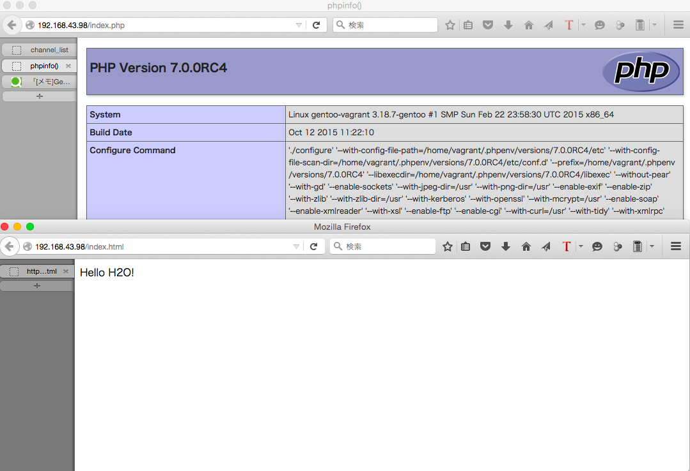

# GentooをVMから起動する。
下記からVMを作成する。
http://qiita.com/igara/items/989ea37805f0db85b2f2

VMのネットワークをブリッジにして実行

# H2Oをインストールする前の準備
Gentooにsshで接続したら下記コマンドたちを実行する。

## Gitをインストール

```
$ sudo emerge git
```

## libyamlをインストール

```
$ sudo emerge libyaml
```

# H2Oのインストール

下記を参考
https://h2o.examp1e.net/install.html

```
# H2Oをダウンロード
$ wget https://github.com/h2o/h2o/archive/v1.5.0.tar.gz
# 解凍
$ tar zxf v1.5.0.tar.gz

# 解凍して作成したディレクトリに移動する
$ cd h2o-1.5.0/
# -DWITH_BUNDLED_SSLフラグというのがあるのだそうだ
$ cmake -DWITH_BUNDLED_SSL=on .

# build
$ cmake .
$ make h2o
$ sudo make install
```

# H2Oの設定ファイル作成

```h2o.conf
user: vagrant

listen: 80

hosts:
 "example.com":
   paths:
    /:
     file.dir: /home/vagrant/public_html

file.custom-handler:
 extension: .php
 fastcgi.connect:
  host: 127.0.0.1
  port: 9000
  type: tcp

access-log: /home/vagrant/access-log
error-log: /home/vagrant/error-log
pid-file: /home/vagrant/pid-file
```

# public_htmlの作成とindex.htmlの作成

```
# public_htmlというディレクトリを作成する
$ mkdir /home/vagrant/public_html
```
public_htmlにindex.htmlとindex.phpを作成する


```index.html
Hello H2O!
```
```index.php
<?PHP
    phpinfo();
```
# H2Oの起動と終了

```
# 起動
$ sudo h2o -m daemon -c h2o.conf
# 終了
$ sudo kill -TERM `cat /home/vagrant/pid-file`
```

# PHPを使えるようにする

## phpenvのインストール

これは
https://blog.sus-happy.net/201506/h2o_php7/#php7-boot
を参照に

```
$ git clone https://github.com/CHH/phpenv.git
$ cd phpenv/bin/
$ sh phpenv-install.sh
```

``` ~/.bashrc
export PATH="/home/vagrant/.phpenv/bin:$PATH"
eval "$(phpenv init -)"
```

```
$ source ~/.bashrc
```

## php-buildのインストール

これも
https://blog.sus-happy.net/201506/h2o_php7/#php7-boot
を参照に

```
$ git clone https://github.com/CHH/php-build.git
$ cd php-build/
$ sudo sh install.sh
```

## PHP7インストール

```
$ php-build --definitions
5.2.17
↑
省略
↓
5.6.14
5.6snapshot
7.0.0alpha1
7.0.0alpha2
7.0.0beta1
7.0.0beta2
7.0.0beta3
7.0.0RC1
7.0.0RC2
7.0.0RC3
7.0.0RC4
7.0snapshot
master
```

PHPに必要なライブラリを入れる

```
# libjpegをインストール
$ wget http://www.ijg.org/files/jpegsrc.v9a.tar.gz
$ tar xzf jpegsrc.v9a.tar.gz
$ ./configure --enable-shared
$ make
$ make install

# libpngをインストール
$ wget http://prdownloads.sourceforge.net/libpng/libpng-1.6.18.tar.gz
$ tar xzf libpng-1.6.18.tar.gz
$ cd libpng-1.6.18
$ ./configure --enable-shared
$ make
$ sudo make install

$ cd

# まだ足りないのがあるかも
USE="tidy" emerge php
USE="fpm" emerge php

```
7.0.0RC4をビルド

```
$ sudo php-build 7.0.0RC4 ~/.phpenv/versions/7.0.0RC4
```

インストールしたことがあるPHPバージョン確認

```
$ phpenv versions
$ php-fpm -v
# 現在のバージョンを確認する
```
PHPバージョンを切り替える

```
$ phpenv global 7.0.0RC4
$ php-fpm -v
# 現在のバージョンを確認する
```

PHP Config

```
# php-fpm.confを更新
$ cp ~/.phpenv/versions/7.0.0RC4/etc/php-fpm.conf.default ~/.phpenv/versions/7.0.0RC4/etc/php-fpm.conf
# php-fpm.d/www.confも更新
cp ~/.phpenv/versions/7.0.0RC4/etc/php-fpm.d/www.conf.default ~/.phpenv/versions/7.0.0RC4/etc/php-fpm.d/www.conf 

# php-fpmを実行
~/.phpenv/versions/7.0.0RC4/sbin/php-fpm &
# エラーが出なければ問題無し
```

H2Oを起動してindex.htmlとindex.phpを見てみる



# laravelのプロジェクトを作成する

```
# composerのインストール
$ curl -sS https://getcomposer.org/installer | sudo php -- --install-dir=/usr/local/bin --filename=composer
$ composer global require "laravel/installer=~1.1"
$ laravel new slack_rack_php
```
h2oのpathsをlaravelのpublicフォルダに変更させる

```h2o.conf
user: vagrant

listen: 80

hosts:
 "example.com":
   paths:
    /:
     file.dir: /home/vagrant/slack_rack_php/public

file.custom-handler:
 extension: .php
 fastcgi.connect:
  host: 127.0.0.1
  port: 9000
  type: tcp

access-log: /home/vagrant/access-log
error-log: /home/vagrant/error-log
pid-file: /home/vagrant/pid-file
```
