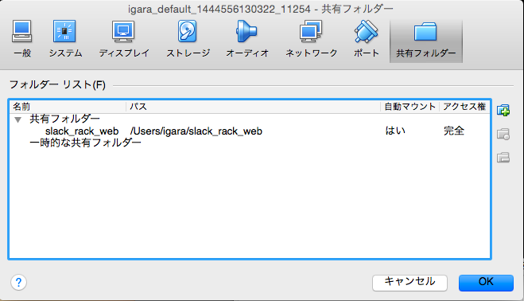

# 前回使ったVM
http://qiita.com/igara/items/1b7cd8e714844440795d

VirtualBoxのメニューより
デバイス->共有フォルダー設定


実際存在する共有したいフォルダを選択

# マウント

GentooのVMを起動する

```
# マウント対象の共有のフォルダがあるか見る
$ ls /media
  sf_slack_rack_web
# マウント
$ sudo mount -t vboxsf slack_rack_web /home/vagrant/web
# ゲストでwebフォルダを事前に作成する必要がある
```
