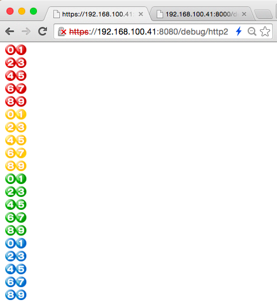
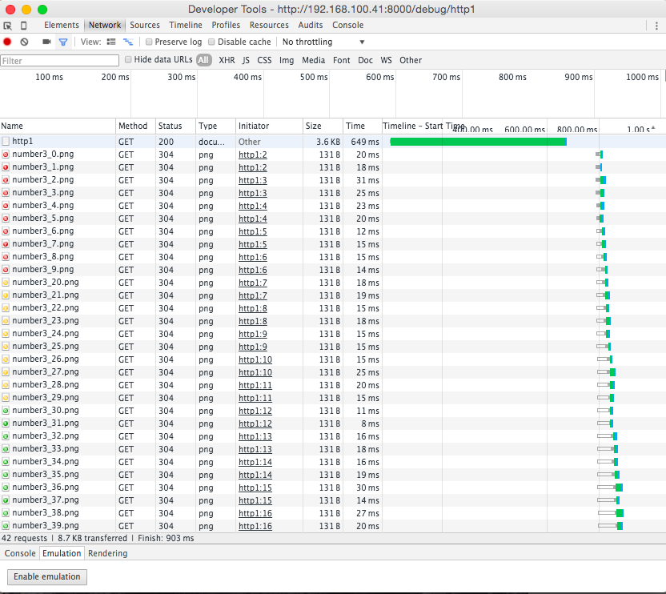
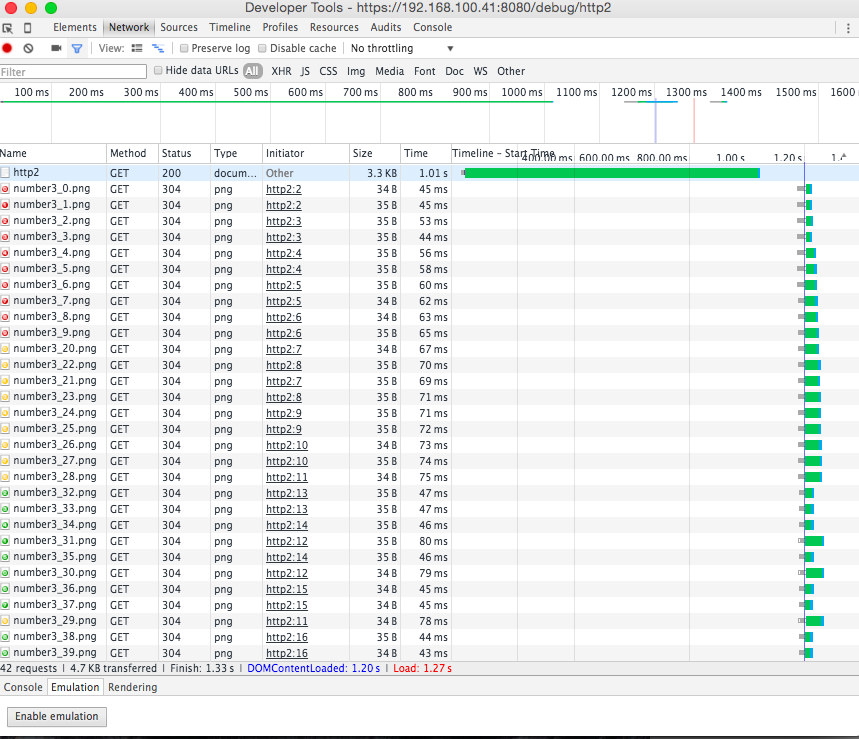

### 前提

H2Oインストール済みであること
http://qiita.com/igara/items/1b7cd8e714844440795d

opensslをインストール済みであること

### オレオレ認証書を作成する

```

$ openssl genrsa 2048 > server.key
$ openssl req -new -key server.key > server.csr
$ openssl x509 -days 3650 -req -signkey server.key < server.csr > server.crt

```
設定はお好きに

### H2Oのコンフィグを作成

http通信用に作成

```h2o.conf

hosts:
 "example.com":
    listen:
     port: 8000
    paths:
        /:
         file.dir: /home/vagrant/web/slack_rack_php/public
         redirect:
           url: /index.php/
           internal: YES
           status: 307

file.custom-handler:
 extension: .php
 fastcgi.connect:
  host: 127.0.0.1
  port: 9000
  type: tcp

access-log: /home/vagrant/access-log
error-log: /home/vagrant/error-log
pid-file: /home/vagrant/pid-file

```

リバースプロキシとSSLの設定されたコンフィグ

```proxy.conf

listen:
 port: 8080
 ssl:
  certificate-file: /home/vagrant/server.crt
  key-file: /home/vagrant/server.key
hosts:
  default:
    paths:
      /:
        proxy.reverse.url: http://127.0.0.1:8000/

access-log: /home/vagrant/accessre-log
error-log: /home/vagrant/errorre-log
pid-file: /home/vagrant/pidre-file

```

### H2Oの起動

```

sudo h2o -m daemon -c h2o.conf
sudo h2o -m daemon -c proxy.conf

```

### HTTP/1とHTTP/2の比較

画像をいっぱい読み込むページを作成してみてちょっと比較を行ってみた。

こんなの



Chromeのプラグインで「HTTP/2 and SPDY indicator」もしくは
firefoxだと「SPDY indicator」というのを入れると
URLの隣に青いイナズマが表示され、
HTTP/2を用いられているサイトだとわかる。

#### HTTP/1



#### HTTP/2




HTTP/2は並列的に画像のダウンロードされているんですね。
