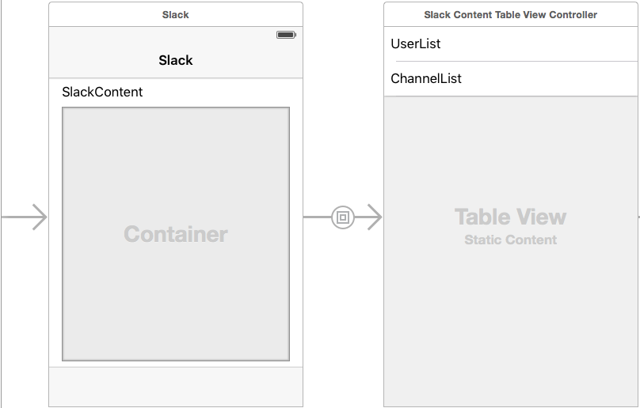
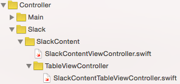
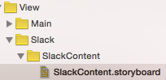
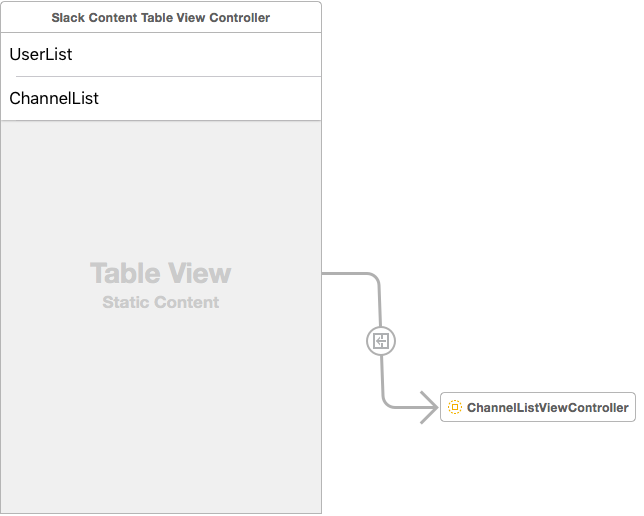

#### 概要
StoryBoardを用いることで画面遷移がコードで実装しなくても楽に行うことができるようになったが、
StoryBoardを一部分割したい、1つのStoryBoardで多数のViewControllerを用いて処理の分割したい
といった内容について投稿してみる。

#### Container View Controller

iOS5から使えるようになった機能
StoryBoard上のViewControllerに子のViewControllerを配置することができる。
よくやることとして
UITableViewの処理をUITableViewControllerのサブクラスに置いてあげて、
StroyBoard上のUITableViewControllerのクラスをサブクラス指定してあげて、
ContainerViewControllerにSegueさせるということをやっている。
TabelViewの中身が静的な物であればStoryBoard上に直接書くというのも考えてもいいと思う。
ViewControllerの肥大化を防ぐことにも繋がるのではなかろうか。

この時のクラス構成としてはこうなった。

#### StoryBoard Reference

この機能はXcode7から用いることができるようになった機能
StoryBoardの特徴として
1つのStoryBoardで画面構成を作成することができるが
多人数の開発だと競合を多発させる場面が出るだろう。
できるだけ競合を防ぐためにもStoryBoardは細かく作っていきたい。
個人的には1つのStoryBoardで1つだけの画面を作っていきたい派である。
ちょっと前ではStoryBoardを分割するためにコード上でStoryBoard上のViewControllerを呼び出してpushさせるということをやっていたがそれをInterfaceBuilder上でできるのはすごい。

上の図ではChannelListと記載されたセルをタップした時に
別のStroyBoardを呼ぶようになっている。
