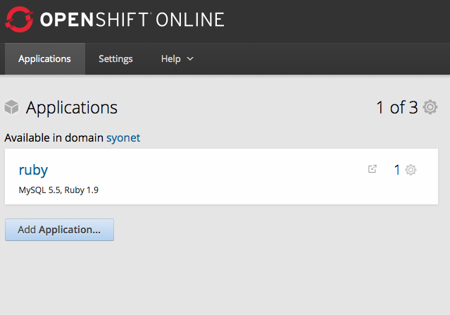
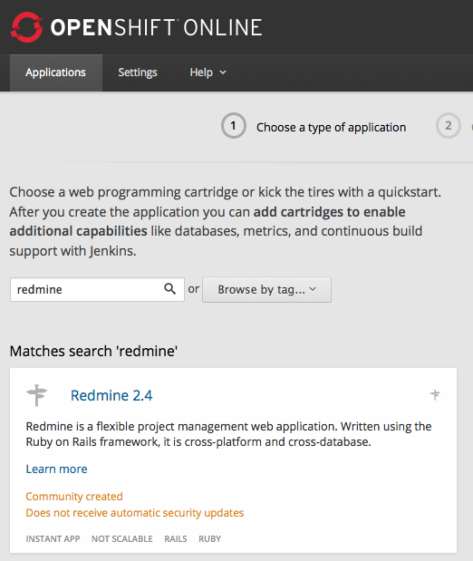
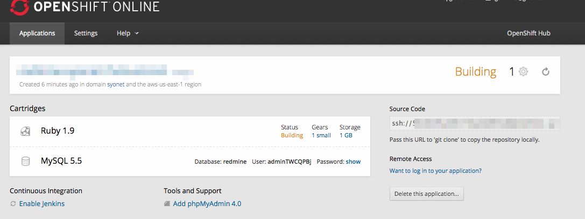
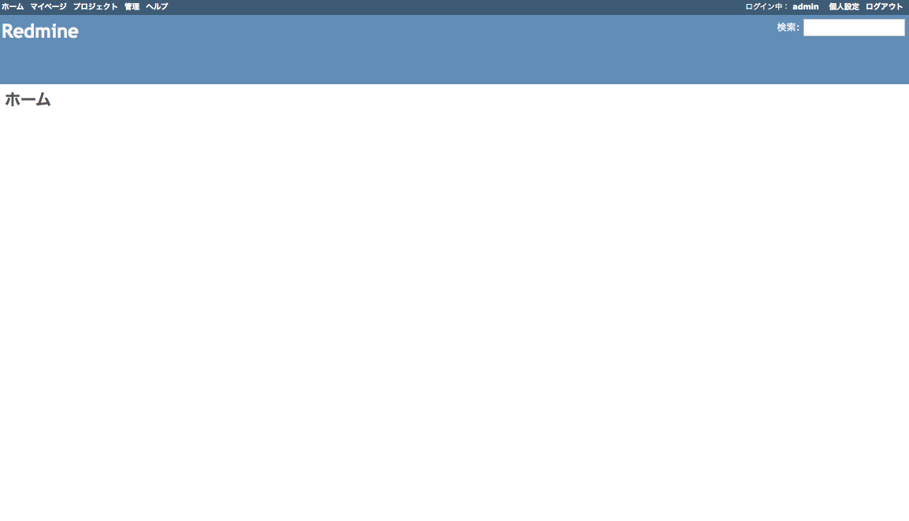
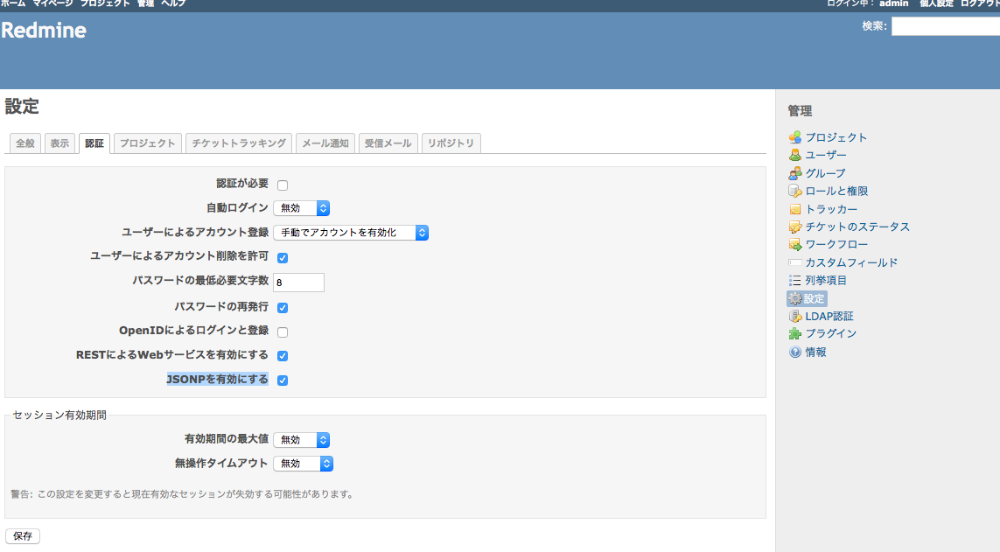
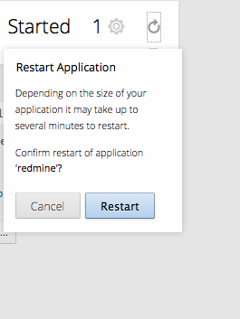
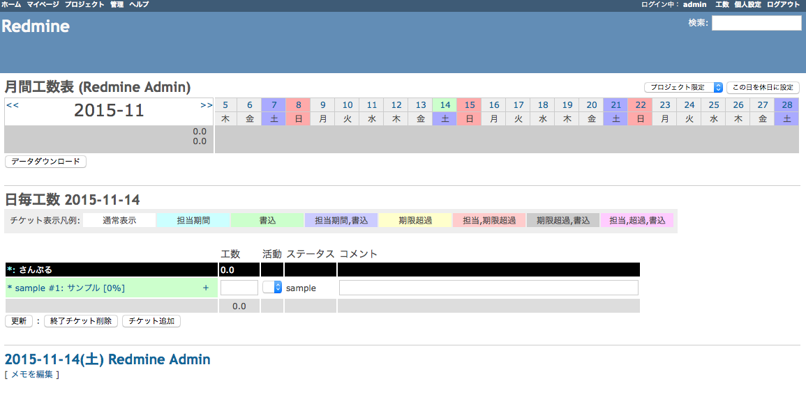

### OpenShiftのアカウントを作成する

下記サイトから登録
https://www.openshift.com/

### アプリケーション(Redmineのプロジェクト)の追加を行う

ログイン後の下記URLからアプリケーションの追加を行う
https://openshift.redhat.com/app/console/applications



Add Application...をクリック



redmineで検索してみると候補に上がってくる。

設定画面の説明は割愛
Createをクリックするとビルドが始まるのでしばらく待つ。



ビルドが完了後、青色のモザイク部分のリンクをクリックして
Redmineの画面を開く



### Redmine APIと戯れる

#### REST APIの使用許可
許可しなくても取得できるものもあるが
管理->設定->認証から
REST APIの使用を許可する（注意）。


#### APIの一覧

公式の説明は下記
http://www.redmine.org/projects/redmine/wiki/Rest_api

APIが出力されるフォーマットとしてxml,jsonを対応している。

##### Project プロジェクト API

公式
http://www.redmine.org/projects/redmine/wiki/Rest_Projects

プロジェクトの一覧を取得するとき
GET
http://{RedmineのURL}/projects.xml

こんな感じのが取得できる

```

<?xml version="1.0" encoding="UTF-8"?>
<projects total_count="2" offset="0" limit="25" type="array">
  <project>
    <id>1</id>
    <name>さんぷる</name>
    <identifier>sample</identifier>
    <description/>
    <created_on>2015-11-14T08:14:05Z</created_on>
    <updated_on>2015-11-14T08:14:05Z</updated_on>
  </project>
  <project>
    <id>2</id>
    <name>サンプルだ</name>
    <identifier>sampleda</identifier>
    <description/>
    <created_on>2015-11-14T09:48:02Z</created_on>
    <updated_on>2015-11-14T09:48:02Z</updated_on>
  </project>
</projects>


```

IDかidentifilterからプロジェクトを取得するとき
GET
http://{RedmineのURL}/projects/{idかidentifilter}.xml
出力される内容はプロジェクトの一覧取得するのに対して絞り込んで
出力されるような結果になる。

##### Time Entries 工数 API

公式の説明は下記
http://www.redmine.org/projects/redmine/wiki/Rest_TimeEntries

積まれていった工数時間を取得するとき
GET
http://{RedmineのURL}/time_entries.xml

デロデロ出る

```
<?xml version="1.0" encoding="UTF-8"?>
<time_entries total_count="2" offset="0" limit="25" type="array">
  <time_entry>
    <id>2</id>
    <project id="2" name="サンプルだ"/>
    <issue id="3"/>
    <user id="3" name="igara"/>
    <activity id="2" name="さんぷる"/>
    <hours>8.0</hours>
    <comments>
    </comments>
    <spent_on>2015-11-14</spent_on>
    <created_on>2015-11-14T10:02:50Z</created_on>
    <updated_on>2015-11-14T10:02:50Z</updated_on>
  </time_entry>
  <time_entry>
    <id>1</id>
    <project id="1" name="さんぷる"/>
    <issue id="1"/>
    <user id="1" name="Redmine Admin"/>
    <activity id="2" name="さんぷる"/>
    <hours>2.5</hours>
    <comments>
    </comments>
    <spent_on>2015-11-14</spent_on>
    <created_on>2015-11-14T09:38:19Z</created_on>
    <updated_on>2015-11-14T09:38:19Z</updated_on>
  </time_entry>
</time_entries>

```


### Redmineのプラグインを追加する

#### SSH接続する

下記を参照にアプリケーションのサーバにSSHできるようにする。
https://developers.openshift.com/en/managing-remote-connection.html

#### WorkTime

```

cd ~/app-root/repo/plugins
wget https://bitbucket.org/tkusukawa/redmine_work_time/downloads/redmine_work_time-0.3.1.zip
unzip redmine_work_time-0.3.1.zip
cd ~/app-root/repo/
rake redmine:plugins:migrate RAILS_ENV=production

```

OpenShiftのアプリケーション画面から再起動をかける


これでRedmineの画面右上から工数を確認できるようになる

