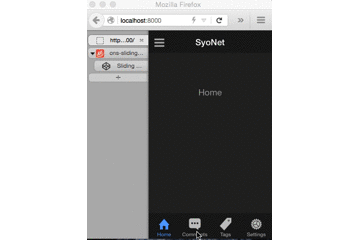
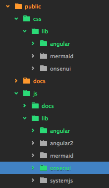
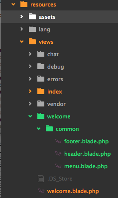
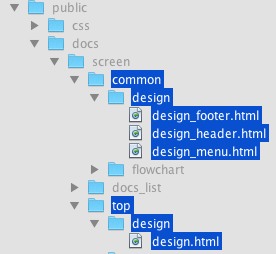

# OnsenUIとは

モバイル向けに作られたHTML5フレームワーク
クラウドIDEのmonacaでも用いられており、Webでもネイティブアプリでも使えるハイブリットなアプリ作りに貢献しているようだ。
http://docs.monaca.mobi/2.9/ja/onsenui/

# こういったサイトを作ってみたかったんだよ!



タブバーとスワイプでサイドナビゲーションが表示されるサイト

# 作成方法など

laravelで作成されたプロジェクトを対象に説明

## npm install

nodejsインストールされている前提で説明
下記を実行してライブラリをダウンロード

```

npm install gulp --save-dev
npm install angular --save-dev
npm install onsenui --save-dev

```

## gulp task

``` gulpfile.js

var gulp = require('gulp');

gulp.task('import', function() {

    // onsenUIをpublic下に設置する。
    var onsenUIPath = 'node_modules/onsenui';
    gulp.src(onsenUIPath + '/css/**')
        .pipe(gulp.dest('public/css/lib/onsenui'));
    gulp.src(onsenUIPath + '/js/**')
        .pipe(gulp.dest('public/js/lib/onsenui'));

    // AngularJSをpublic下に設置する。
    var angularJSPath = 'node_modules/angular';
    gulp.src(angularJSPath + '/angular.min.js')
        .pipe(gulp.dest('public/js/lib/angular'));
    gulp.src(angularJSPath + '/angular-csp.css')
        .pipe(gulp.dest('public/css/lib/angular'));

}

```

gulpのタスクを実行する。

```

# プロジェクトのディレクトリ配下にいるときに下記実行
./node_modules/.bin/gulp import

```

これでpublic下にcss,jsファイルが移動されるはず。




## プロジェクトのresources下を編集

使うのは
laravelでデフォルトで作成されているwelcome.blade.phpと
新規で作成したwelcome/common/***.brade.php



### welcome.blade.phpの編集

```welcome.blade.php

<!DOCTYPE html>
<html>
<head>
    <link href="../css/lib/onsenui/onsenui.css" rel="stylesheet" type="text/css">
    <link href="../css/lib/onsenui/onsen-css-components-dark-theme.css" rel="stylesheet" type="text/css">
    <script type="text/javascript" src="../js/lib/systemjs/system.js"></script>
    <script type="text/javascript" src="../js/lib/angular/angular.min.js"></script>
    <script type="text/javascript" src="../js/lib/onsenui/onsenui.min.js"></script>
    <script>
        ons.bootstrap();
    </script>
</head>
<body>
@include('welcome.common.header')
@include('welcome.common.menu')
@include('welcome.common.footer')
</body>
</html>

```

### ファイルの新規作成

#### 画面下のタブを構成するテンプレートを作成する

```footer.blade.php

<!-- フッター -->
<ons-template id="tabbar.html">
    <ons-tabbar var="tabbar">
  	  <ons-tab page="home.html" label="Home" icon="ion-home" active="true"></ons-tab>
      <ons-tab page="comments.html" label="Comments" icon="ion-chatbox-working"></ons-tab>
      <ons-tab page="tags.html" label="Tags" icon="ion-ios-pricetag"></ons-tab>
      <ons-tab page="settings.html" label="Settings" icon="ion-ios-cog">
    </ons-tab>
  </ons-tabbar>
</ons-template>
<!-- /フッター -->

```

#### 各メニューのページ内容を表示するテンプレートを作成する

``` menu.blade.php

<ons-sliding-menu var="menu" menu-page="menu.html" main-page="tabbar.html" side="left" type="push" max-slide-distance="200px">
</ons-sliding-menu>

<!-- サイドメニュー -->
<ons-template id="menu.html">
  <ons-list>
    <ons-list-item modifier="chevron" onclick="tabbar.setActiveTab(0), menu.closeMenu()">
      Home
    </ons-list-item>
    <ons-list-item modifier="chevron" onclick="tabbar.setActiveTab(1), menu.closeMenu()">
      Comments
    </ons-list-item>
    <ons-list-item modifier="chevron" onclick="tabbar.setActiveTab(2), menu.closeMenu()">
      Tags
    </ons-list-item>
    <ons-list-item modifier="chevron" onclick="tabbar.setActiveTab(3), menu.closeMenu()">
      Settings
    </ons-list-item>
  </ons-list>
</ons-template>
<!-- /サイドメニュー -->

<!-- メニューのコンテンツ内容 -->
<ons-template id="home.html">
  <ons-page>
    <p style="text-align: center; color: #999; padding-top: 50px;">
      Home
    </p>
  </ons-page>
</ons-template>

<ons-template id="comments.html">
  <ons-page>
    <p style="text-align: center; color: #999; padding-top: 50px;">
      Comments
    </p>
  </ons-page>
</ons-template>

<ons-template id="tags.html">
  <ons-page>
    <p style="text-align: center; color: #999; padding-top: 50px;">
      Tags
    </p>
  </ons-page>
</ons-template>

<ons-template id="settings.html">
  <ons-page>
    <p style="text-align: center; color: #999; padding-top: 50px;">
      Setting
    </p>
  </ons-page>
</ons-template>
<!-- /メニューのコンテンツ内容 -->

```

#### ヘッダー部

``` header.blade.php
<!-- ヘッダー -->
<ons-template id="header.html">
    <ons-toolbar>
        <div class="left">
            <!-- サイドメニューを表示する三表示 -->
            <ons-toolbar-button ng-click="menu.toggleMenu()">
                <ons-icon icon="bars"></ons-icon>
            </ons-toolbar-button>
        </div>
        <!-- タイトル -->
        <div class="center">SyoNet</div>
    </ons-toolbar>
    <!-- フッターを呼び出す -->
    <ng-include src="'tabbar.html'"></ng-include>
</ons-template>
<!-- /ヘッダー -->

```

これでサイドナビゲーションとタブバーの実装ができる


# 所感

今回はサーバ側で各コンテンツのテンプレートを全て静的に取得したが、
せっかくAngularJS使っているのならば「ng-include」を用いてボタンタップ時にhtmlの内容を動的に取得しに行くのもいいなと感じた。
初期で表示する部分はサーバで作成し、タップ後の処理はクライアントに任せてしまうのが良さそう。

次世代バージョンでOnsenUI2やAngular2とかでているがどちらもalpha版、beta版である。
OnsenUIの一部コンポーネントはAngularを用いなくても使えるようだがサイドナビゲーションなどはangularを用いらないといけないようである。
http://onsen.io/2/reference/javascript.html

2015/12/5時点
OnsenUI2ではまだサイドナビゲーションが使えない模様
https://github.com/OnsenUI/OnsenUI/issues/1038

2015/12/25時点
OnsenUI2でサイドナビゲーションが使えるようになった！

# 全てHTMLで管理させる

ほぼほぼ上記で書いていたことと同じになるが

ディレクトリ構造として




``` public/docs/screen/top/design/design.html

<!DOCTYPE html>
<html>
    <head>
        <link href="../../../../css/lib/onsenui/onsenui.css" rel="stylesheet" type="text/css">
        <link href="../../../../css/lib/onsenui/onsen-css-components-dark-theme.css" rel="stylesheet" type="text/css">
        <script type="text/javascript" src="../../../../js/lib/systemjs/system.js"></script>
        <script type="text/javascript" src="../../../../js/lib/angular/angular.min.js"></script>
        <script type="text/javascript" src="../../../../js/lib/onsenui/onsenui.min.js"></script>
        <script>
            ons.bootstrap();
        </script>
    </head>
    <body>
    <ng-include src="'../../common/design/design_menu.html'"></ng-include>
</body>
</html>

```

``` public/docs/screen/common/design/design_footer.html

<!-- フッター -->
<ons-tabbar var="tabbar">
    <ons-tab page="home.html" label="Home" icon="ion-home" active="true"></ons-tab>
    <ons-tab page="comments.html" label="Comments" icon="ion-chatbox-working"></ons-tab>
    <ons-tab page="tags.html" label="Tags" icon="ion-ios-pricetag"></ons-tab>
    <ons-tab page="settings.html" label="Settings" icon="ion-ios-cog">
    </ons-tab>
</ons-tabbar>
<!-- /フッター -->

```

``` public/docs/screen/common/design/design_menu.html

<ons-sliding-menu var="menu" menu-page="menu.html" main-page="../../common/design/design_header.html" side="left" type="push" max-slide-distance="200px">
</ons-sliding-menu>

<!-- サイドメニュー -->
<ons-template id="menu.html">
    <ons-list>
        <ons-list-item modifier="chevron" onclick="tabbar.setActiveTab(0), menu.closeMenu()">
            Home
        </ons-list-item>
        <ons-list-item modifier="chevron" onclick="tabbar.setActiveTab(1), menu.closeMenu()">
            Comments
        </ons-list-item>
        <ons-list-item modifier="chevron" onclick="tabbar.setActiveTab(2), menu.closeMenu()">
            Tags
        </ons-list-item>
        <ons-list-item modifier="chevron" onclick="tabbar.setActiveTab(3), menu.closeMenu()">
            Settings
        </ons-list-item>
    </ons-list>
</ons-template>
<!-- /サイドメニュー -->

<!-- メニューのコンテンツ内容 -->
<ons-template id="home.html">
    <ons-page>
        <p style="text-align: center; color: #999; padding-top: 50px;">
            Home
        </p>
    </ons-page>
</ons-template>

<ons-template id="comments.html">
    <ons-page>
        <p style="text-align: center; color: #999; padding-top: 50px;">
            Comments
        </p>
    </ons-page>
</ons-template>

<ons-template id="tags.html">
    <ons-page>
        <p style="text-align: center; color: #999; padding-top: 50px;">
            Tags
        </p>
    </ons-page>
</ons-template>

<ons-template id="settings.html">
    <ons-page>
        <p style="text-align: center; color: #999; padding-top: 50px;">
            Setting
        </p>
    </ons-page>
</ons-template>
<!-- /メニューのコンテンツ内容 -->

```

``` public/docs/screen/common/design/design_header.html

<!-- ヘッダー -->
<ons-toolbar>
    <div class="left">
        <!-- サイドメニューを表示する三表示 -->
        <ons-toolbar-button ng-click="menu.toggleMenu()">
            <ons-icon icon="bars"></ons-icon>
        </ons-toolbar-button>
    </div>
    <!-- タイトル -->
    <div class="center">SyoNet</div>
</ons-toolbar>
<!-- /ヘッダー -->

<!-- フッターを呼び出す -->
<ng-include src="'../../common/design/design_footer.html'"></ng-include>

```

たまに描画ができないときがある
