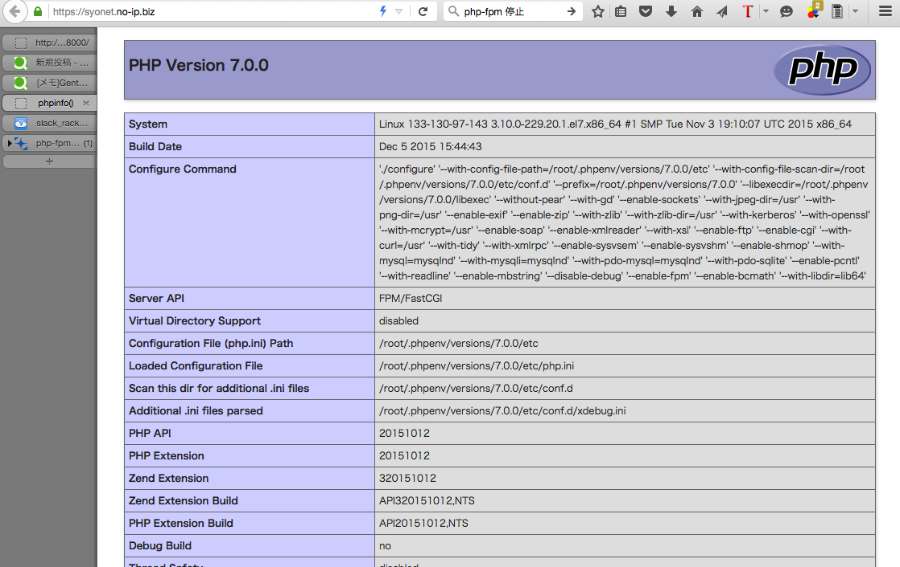

# 前もこんな記事書いてました

[メモ]GentooにH2O+PHP7.0.0RC4をインストールする。
http://qiita.com/igara/items/1b7cd8e714844440795d

今回はアップデートについて記載

# 起動中のphp-fpmを停止させる

```
# php-fpmプロセスを調べる
ps -ef

php-fpm: master process (/root/.
nobody   23272 23271  0 16:09 ?        00:00:00 
↑これがphp-fpmのプロセスで23272がプロセスID
php-fpm: pool www
nobody   23273 23271  0 16:09 ?        00:00:00 php-fpm: pool www
root     23274     2  0 16:09 ?        00:00:00 [kworker/0:2]
root     23322     2  0 16:14 ?        00:00:00 [kworker/0:0]

kill 23271

```

# php-buildを更新する

以前、phpのソースをビルドした場合コンフリクトを発生させるためresetする必要がある。

```

cd .phpenv/plugins/php-build/
git reset --hard
git pull

```

# php7.0.0をビルドする

```

phpenv install 7.0.0
phpenv global 7.0.0
phpenv local 7.0.0
phpenv rehash

```

```

# 設定ファイルの適応
cd /root/.phpenv/versions/7.0.0/etc/
cp php-fpm.conf.default php-fpm.conf
cd /root/.phpenv/versions/7.0.0/etc/php-fpm.d/
cp www.conf.default www.conf

```


#php7.0.0のphp-fpmを起動する

```

~/.phpenv/versions/7.0.0/sbin/php-fpm &

```

# 完了!

