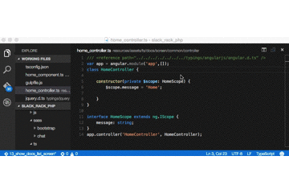
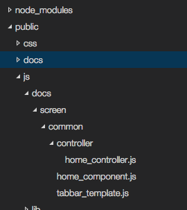

# TypeScript

MicroSoftによって開発されたAltJS。
動的型付けの通常のJavaScriptに対し、静的型付けができるES6という立場である。
TSDを用いれば既存のJavaScriptライブラリに型情報を加えることのでき、jQueryといったライブラリに対しても型情報を提供してくれる。

# 環境構築

前提としてNodeJSがインストールされていること。
例のごとくlaravelのプロジェクト構成を前提に説明を行う。

## npm install

```

$ npm install typescript --save-dev
$ npm install tsd --save-dev
$ npm install gulp --save-dev
$ npm install gulp-shell --save-dev
$ npm install gulp-tsconfig-update --save-dev

```

## エディタ

### Visual Studio Code



個人的にはCodeの方でTypeScript書くことが多いかもしれない
gif画像の例ではimportされていたファイル名を変更して
わざとimportのエラーが発生していることを表示している。

### Atom

あらゆるスニペッドが揃ってて何かと使用するAtom。ただAtomのプラグインとしてTypeScriptの開発をしている以上、ここはVSCに慣れるようにしよう。

AtomのAPI仕様変更について過去このようなことがあった
http://flabo.io/code/20150430/01-start-typescript-independently-of-windows/

### 公式のPlayground

遊ぶ分には下記のサイトでも十分

http://www.typescriptlang.org/Playground

# 設定

## tscコマンド

tsconfig.jsonに指定できるものが多くあるためちょくちょく記載する。
デフォルト値とかおいおい書くこと

|プロパティ|説明|
|:-----------|:-----------|
| --declaration | .tsファイルから.d.tsファイルを作成する。 |
| --help | コンパイラのヘルプを表示 |
| --version | tscのバージョンを表示 |
| --module | CommonJSやAMDのモジュールの指定をしてビルドを行える |
| --project | 対象のディレクトリを指定 |
| --target | ECMAScriptのバージョンを指定 |
| --watch | 常駐状態になり、projectで変更があったファイルを自動ビルドする |
| --charset | ビルド後の文字コードを指定する |
| --diagnostics | ビルドの結果を表示する |
| --emitBOM | 出力ファイルの先頭にUTF- 8バイトオーダーマークを出力する |
| --emitDecoratorMetadata[1] | ソースで装飾された型宣言のメタデータ出力する |
| --inlineSourceMap | 別のファイルのソースと合わせて1つのファイルを出力する。 |
| --inlineSources | 1つのファイル内のmapファイルと一緒にソースを出力する |
| --isolatedModules | 無条件に未解決のファイルのインポートする |
| --jsx | JSXのサポート 'React' や 'Preserve'をサポート |
| --listFiles | |
| --locale | |
| --mapRoot | |
| --moduleResolution[1] | |
| --newLine | |
| --noEmit | |
| --noEmitOnError | |
| --noEmitHelpers | |
| --noImplicitAny | |
| --noLib | デフォルトではライブラリファイル（ lib.d.ts ）が含まれていない |
| --noResolve | |
| --out | このオプションの仕様は推奨されていない。代わりに--outfileを使用すること。 |
| --outDir | ディレクトリへの出力構造を保つ |
| --outFile | |
| --preserveConstEnums | 生成されたコード内の定数enum宣言を消去させない |
| --removeComments | コンパイル後のソースファイル内の全てのコメントを削除します！ * |
| --rootDir | |
| --sourceMap | |
| --sourceRoot | |
| --stripInternal[1] | |
| --suppressImplicitAnyIndexErrors | |
| --noImplicitAny | |

## tsconfig.json

tsconfig.jsonとはtscビルドするときの設定ファイル
tscコマンドのオプションをキーとして値を入れてあげれば tsc と打つだけで好みのビルドがされる。

一旦下記で作成

```tsconfig.json

{
    "compilerOptions": {
        "module": "commonjs",
        "project": "./",
        "removeComments": true,
        "noImplicitAny": true,
        "noLib" : false,
        "declaration" : false,
        "preserveConstEnums": true,
        "experimentalDecorators": true,
        "emitDecoratorMetadata": true,
        "suppressImplicitAnyIndexErrors": true,
        "sourceMap": false,
        "target": "ES3"
    }
}

```

## tsd
*.d.tsファイルと呼ばれる型定義ファイルを管理するパッケージ
TypeScriptで他のモジュールをインポート行いたいときに型定義ファイルを用いる

```型定義ファイルのインストール

./node_modules/.bin/tsd install jquery --save

```

インストール後、tsd.jsonで管理されるようになる。

```tsd.jsonの例

{
  "version": "v4",
  "repo": "borisyankov/DefinitelyTyped",
  "ref": "master",
  "path": "typings",
  "bundle": "typings/tsd.d.ts",
  "installed": {
    "angularjs/angular.d.ts": {
      "commit": "5a8fc5ee71701431e4fdbb80c506e3c13f85a9ff"
    },
    "jquery/jquery.d.ts": {
      "commit": "5a8fc5ee71701431e4fdbb80c506e3c13f85a9ff"
    },
    "angular2/angular2.d.ts": {
      "commit": "8ea42cd8bb11863ed6f242d67c502288ebc45a7b"
    }
  }
}

```

型定義ファイルはtypingsというディレクトリ内に配置される。

## gulp-tsconfig-update

tsconfig.jsonに対し、ビルド行いたいtsファイルの追加を行うパッケージ

下記のページを見てtscとgulp-typescriptやgulp-tscなどのパッケージとの依存をなくすためにtsconfigでビルド対象を管理させるのは良いことだと感じられる。

gulp.srcのglobからtsconfig.jsonのfilesを更新するプラグインを作った
http://qiita.com/laco0416/items/a51b7534ddc4aec63875
TypeScript の開発環境構築と周辺ツールの紹介
https://html5experts.jp/vvakame/17004/

tsconfigが正常に設定させる利点としてVisual Studio Codeで開発がしやすくなるとのこと

## gulpの設定

TypeScriptのビルドをタスクランさせる設定を記載する。

```gulpfile.json

var gulp = require('gulp');

gulp.task('tsbuild', function() {
    var shell = require('gulp-shell');
    // tsファイルのビルド
    gulp.src('').pipe(shell('./node_modules/.bin/tsc'));

    /* resources/assets/ts/docs/下に存在する、ビルドで作成されたjsファイルを
       public/js/docs/下にディレクトリ構造ごとコピーする */
    gulp.src('resources/assets/ts/docs/**/*.js')
        .pipe(gulp.dest('public/js/docs/')); 
});

gulp.task('tsconfig', function() {
    var tsConfig = require('gulp-tsconfig-update');
    
    // ビルド対象のファイルを指定する
    gulp.src(
        'resources/assets/ts/**/*.ts').pipe(tsConfig());
});

```

先にtsconfigの更新を行う

```

$ ./node_modules/.bin/gulp tsconfig

```

するとtsconfig.jsonが下記のようになる。


```tsconfig.json

{
    "compilerOptions": {
        "module": "commonjs",
        "project": "./",
        "removeComments": true,
        "noImplicitAny": true,
        "noLib" : false,
        "declaration" : false,
        "preserveConstEnums": true,
        "experimentalDecorators": true,
        "emitDecoratorMetadata": true,
        "suppressImplicitAnyIndexErrors": true,
        "sourceMap": false,
        "target": "ES3"
    },
    "files": [
        "resources/assets/ts/docs/screen/common/home_component.ts",
        "resources/assets/ts/docs/screen/common/tabbar_template.ts",
        "resources/assets/ts/docs/screen/common/controller/home_controller.ts"
    ]
}

```

tsファイルのビルド

```

$ ./node_modules/.bin/gulp tsbuild

```




public下にjsが作成された。


# TypeScriptの書き方

ES6の書き方がほぼほぼだがまずは書く

公式でお試しにコードがかけるのがあるので遊んでみよう
http://www.typescriptlang.org/Playground

開いたときに挨拶するためのクラスがPlayground上に表示されるので既存のコードを元に説明を行う

## クラス構文

ES6をばりばり使うなら絶対使いたい構文
オブジェクト指向な書き方っぽい

```

class Greeter {
    greeting: string;

    // インスタンス時に呼ばれるメソッド
    constructor(message: string) {
        this.greeting = message;
    }

    greet() {
        return "Hello, " + this.greeting;
    }
}

// クラスのインスタンス化
var greeter = new Greeter("world");

// ボタンを作る
var button = document.createElement('button');
button.textContent = "Say Hello";
button.onclick = function() {
    // ボタンをクリックしたときの処理
    alert(greeter.greet());
}

document.body.appendChild(button);

```

## const
var以外の変数の1つとしてconstが追加
これを使用することで変数の値が書き換わることのない変数宣言ができる。

```

class Greeter {
    greeting: string;

    // インスタンス時に呼ばれるメソッド
    constructor(message: string) {
        this.greeting = message;
    }

    hello:string = 'hello';

    greet() {
        const hello = 'hello';
        // 下記のコメントはconstに対して値変更を行おうとしているため使用できない
        // hello = this.hello + this.greeting;
        this.hello = hello + this.greeting;
        return this.hello + this.greeting;
    }
}

// クラスのインスタンス化
var greeter = new Greeter("world");

// ボタンを作る
var button = document.createElement('button');
button.textContent = "Say Hello";
button.onclick = function() {
    // ボタンをクリックしたときの処理
    alert(greeter.greet());
}

document.body.appendChild(button);

```

## let

letを使用するとブロックの中と外で同じ変数名でもスコープを分けてくる。
今まで通り、varを使用することができるのでブロック内で変数を変更するコードはvarで宣言させてあげよう。

```
class Greeter {
    greeting: string;

    // インスタンス時に呼ばれるメソッド
    constructor(message: string) {
        this.greeting = message;
    }

    hello:string = 'hello';

    greet() {
        // ifの外では'hello'として扱う
        let hello = 'hello';
        if (true) {
            // ifの中でのhello変数は'hello2'として扱う
            let hello = 'hello2';
            alert(hello);
        }
        this.hello = hello + this.greeting;
        return this.hello;
    }
}

// クラスのインスタンス化
var greeter = new Greeter("world");

// ボタンを作る
var button = document.createElement('button');
button.textContent = "Say Hello";
button.onclick = function() {
    // ボタンをクリックしたときの処理
    alert(greeter.greet());
}

document.body.appendChild(button);

```

## アロー
ES6でもおなじみ
コールバック・無名関数に値渡して行うやり方をアローで行える。

```

let greet:string[] = ['hello', 'bye'];
greet.forEach(args => alert(args));

```
短い（確信）
今までのjsで書くとこんな感じになる。

```

var greet = ['hello', 'bye'];
greet.forEach(function (args) {
    return alert(args);
});

```

```

class Greeter {
    greeting: string;

    // インスタンス時に呼ばれるメソッド
    constructor(message: string) {
        this.greeting = message;
    }

    hello:string = 'hello';

    greet() {
        // 配列の中身はstring
        let greet:string[] = ['hello', 'bye'];
        // さりげなくアロー使って無名関数の記述を省略させる
        greet.forEach(args => alert(args));

        this.greeting = greet + this.greeting;
        return this.greeting;
    }
}

// クラスのインスタンス化
var greeter = new Greeter("world");

// ボタンを作る
var button = document.createElement('button');
button.textContent = "Say Hello";
button.onclick = function() {
    // ボタンをクリックしたときの処理
    alert(greeter.greet());
}

document.body.appendChild(button);

```


## 型宣言
ES6とTypeScriptで圧倒的に違う点として型宣言周り

### 暗黙的な型宣言（型推論）

下記例では
let hello = 'hello';
とした箇所が暗黙的にstring型扱いされてしまっているためnumberが入らない例

```

class Greeter {
    greeting: string;

    // インスタンス時に呼ばれるメソッド
    constructor(message: string) {
        this.greeting = message;
    }

    hello:string = 'hello';

    greet() {
        let hello = 'hello';
		/* 暗黙的型宣言を行われているので数値型を入れようとすると
           エラー出力される */
        // hello = 1;
        this.hello = hello + this.greeting;
        return this.hello;
    }
}

// クラスのインスタンス化
var greeter = new Greeter("world");

// ボタンを作る
var button = document.createElement('button');
button.textContent = "Say Hello";
button.onclick = function() {
    // ボタンをクリックしたときの処理
    alert(greeter.greet());
}

document.body.appendChild(button);

```

たまにライブラリの型宣言ファイルのインポートをしたときに変に想定されてない型を用いようとしエラーが出る場合がある。
解決方法としてこれで良いのか置いといて別の型を扱う場合は
anyを用いることで回避できる。

```

class Greeter {
    greeting: string;

    // インスタンス時に呼ばれるメソッド
    constructor(message: string) {
        this.greeting = message;
    }

    hello:any = 'hello';

    greet() {
        let hello:any = 'hello';
		/* anyとしているため数値型を用いることができる */
        hello = 1;
        this.hello = hello + this.greeting;
        return this.hello;
    }
}

// クラスのインスタンス化
var greeter = new Greeter("world");

// ボタンを作る
var button = document.createElement('button');
button.textContent = "Say Hello";
button.onclick = function() {
    // ボタンをクリックしたときの処理
    alert(greeter.greet());
}

document.body.appendChild(button);

```

### 保証されている型

#### プリミティブ型

| 型 |説明|
|:-----------|:-----------|
| number | 数値を扱う型 |
| boolean | ブール値を扱う型 |
| string | 文字列値を扱う型 |
| void | 関数が値を返さないことを表す型 |
| any | 全ての型の上位にある型 |

#### 配列

型を宣言して配列を作成すると指定した型以外を用いることができなくできる。
型推論で数値型、文字列型が混在するときはanyになるが
あらかじめ入れる物の型が決まってしまっている場合は型を指定してしまった方が良い

```

class Greeter {
    greeting: string;

    // インスタンス時に呼ばれるメソッド
    constructor(message: string) {
        this.greeting = message;
    }

    hello:string = 'hello';

    greet() {
        // 配列の中身はstring
        let greet:string[] = ['hello', 'bye'];
        // さりげなくアロー使って無名関数の記述を省略させる
        greet.forEach(args => alert(args));

        this.greeting = greet + this.greeting;
        return this.greeting;
    }
}

// クラスのインスタンス化
var greeter = new Greeter("world");

// ボタンを作る
var button = document.createElement('button');
button.textContent = "Say Hello";
button.onclick = function() {
    // ボタンをクリックしたときの処理
    alert(greeter.greet());
}

document.body.appendChild(button);

```

#### オプショナル

TypeScriptは宣言と呼び出しに厳しい言語
関数の宣言に引数がある場合、引数を与えなければならないが
引数の後ろに * ? * を置くことで引数がなくても扱うことができる

下記はコンストラクタを無理やりオプショナルにさせた実行例
基本的にオプショナルを扱うのはやめよう

```

class Greeter {
    greeting: string;

    // インスタンス時に呼ばれるメソッド
    constructor(message?: string) {
        this.greeting = message;
    }

    hello:string = 'hello';

    greet() {
        let greet:string[] = ['hello', 'bye'];
		greet.forEach(args => alert(args));
		
        this.greeting = greet + this.greeting;
        return this.greeting;
    }
}

// クラスのインスタンス化
var greeter = new Greeter();

// ボタンを作る
var button = document.createElement('button');
button.textContent = "Say Hello";
button.onclick = function() {
    // ボタンをクリックしたときの処理
    alert(greeter.greet());
}

document.body.appendChild(button);

```
