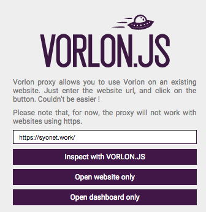
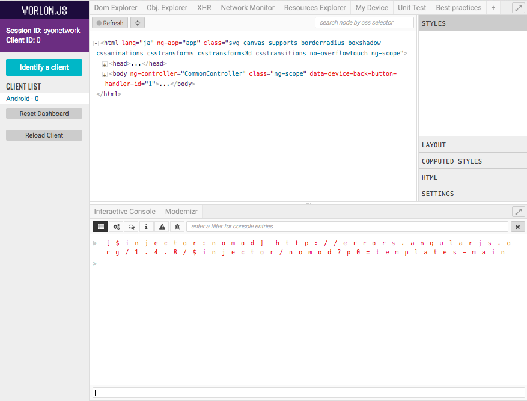
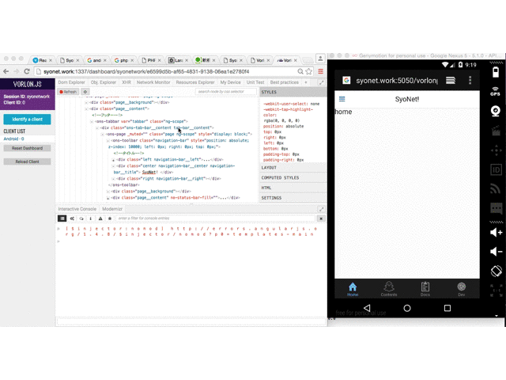
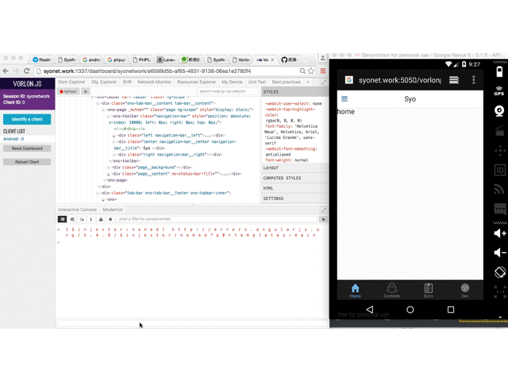

# vorlon.jsとは
* 公式ページ<br>
  http://vorlonjs.com/

Microsoft Build 2015より発表された
Webアプリケーション用のリモートデバッガツール

Web上で使えるchrome developer toolsみたいなもの。

## インストール

前提にNodeJSがインストール済みであること。

```

npm install --save-dev vorlon

```

すると
node_modulesというディレクトリに「.bin」と「vorlon」というのができる。

## 設定

この設定はプロキシ経由でデバッグを行いたいときや
localhostではないホストでデバッグの結果を見たいときに
やっておくと便利な設定。

``` node_modules/vorlon/Server/config.json

{
    "baseURL": "",
    "useSSLAzure":false,
    "useSSL": false,
    "SSLkey": "../cert/server.key",
    "SSLcert": "../cert/server.crt",
    "includeSocketIO": true,
    "activateAuth": false,
    "username": "",
    "password": "",
    "plugins": [
        { "id": "CONSOLE", "name": "Interactive Console", "panel": "bottom", "foldername": "interactiveConsole", "enabled": true },
        { "id": "DOM", "name": "Dom Explorer", "panel": "top", "foldername": "domExplorer", "enabled": true },
        { "id": "MODERNIZR", "name": "Modernizr", "panel": "bottom", "foldername": "modernizrReport", "enabled": true },
        { "id": "OBJEXPLORER", "name": "Obj. Explorer", "panel": "top", "foldername": "objectExplorer", "enabled": true },
        { "id": "XHRPANEL", "name": "XHR", "panel": "top", "foldername": "xhrPanel", "enabled": true },
        { "id": "NGINSPECTOR", "name": "Ng. Inspector", "panel": "top", "foldername": "ngInspector", "enabled": false },
        { "id": "NETWORK", "name": "Network Monitor", "panel": "top", "foldername": "networkMonitor", "enabled": true },
        { "id": "RESOURCES", "name": "Resources Explorer", "panel": "top", "foldername": "resourcesExplorer", "enabled": true },
        { "id": "DEVICE", "name": "My Device", "panel": "top", "foldername": "device", "enabled": true },
        { "id": "UNITTEST", "name": "Unit Test", "panel": "top", "foldername": "unitTestRunner", "enabled": true },
        { "id": "BABYLONINSPECTOR", "name": "Babylon Inspector", "panel": "top", "foldername": "babylonInspector", "enabled": false },
        { "id": "WEBSTANDARDS", "name": "Best practices", "panel": "top", "foldername": "webstandards", "enabled": true }
    ],
    "port": 1337,
    "enableWebproxy" : true,
    "baseProxyURL": "",
    "proxyPort" : 5050,
    "proxyEnvPort": false,
    "vorlonServerURL": "http://[ホスト名]:1337",
    "vorlonProxyURL": "http://[ホスト名]:5050"
}

```

## 起動

```

node ./node_modules/.bin/vorlon &

```

これでデバック用のvorlonサーバが起動する。

## 使い方

**デバッグ方法は2つある！**

1 . proxyを経由させて行う。

サーバを起動して下記ページに遷移する。
http://[ホスト名]:1337/httpproxy

するとこんな感じの画面が出てくる



入力フォームにデバッグしたいページのURLを入れて
「Inspect with VORLON.JS」を押すと
proxy経由で見たデバッグしたい画面と
chromeで見たことがあるような画面が出てくる。



これでデバッグできる状態になる。


2 . デバッグしたいページにデバックのスクリプトを追記する。

```

<script src="http://[ホスト名]:1337/vorlon.js"></script>

```
たまにこの方法の方が効率が良いときがある。
1に記載した方法は端末によって実行できない場合がある。
「Inspect with VORLON.JS」を押してもproxy経由の画面が表示されないことがあった。

上記のスクリプトを埋め込んだ後、
デバッグしたいページをブラウザに表示させればデバック状態にできる。


## どういったことができるのか一例を記載

詳しくは公式のプラグインの記載を見ること。
http://vorlonjs.com/plugins/

参考として事例の記載をしている。
画像はAndroidエミュレータからデバックを行っている例である。

* レイヤーの確認

HTMLの書き換えもできる。



* js console

alert以外にconsole.logも行うことができる。




## 最後に

どんなブラウザの環境でもある程度のデバッグができるのはすごく良い。


safariとchromeの
Web Inspectorの記事も書かなければ
