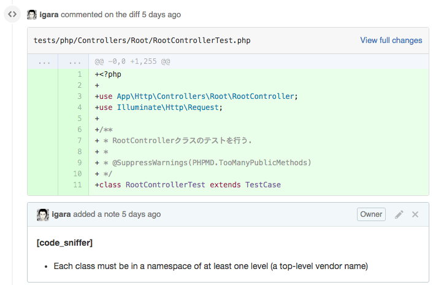
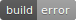
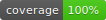

# この記事の概要
GitHubでコミット＆プッシュしたときに自動でテストを行ったり、
PullRequest時では「このコード、コーディング規約違反してるよ！」とコメントしてくれるようなサービスの紹介になる。

PHPプロジェクトについて下記のレポジトリが対象
URL:https://github.com/igara/syonet

# SideCI
URL:https://www.sideci.com/
PullRequestを出した時にコミットしたファイルの静的解析を行い、
コーディング規約違反している対象の行に対してコメントを追加してくれる。


上記はnamespaceの指定がなく、規約に反していますというコメントの例である。

PSRの規約に準じてコメントがされているので
[php-cs-fixer](https://github.com/FriendsOfPHP/PHP-CS-Fixer)をフォーマッタとして用いれば大抵は修正される。
（namespaceの違反は修正されないが、）

コード修正をし、規約どおりになると下記のようにコメントが隠れるようになる。


この時のPullRequestの例として下記になる。
https://github.com/igara/syonet/pull/48

PHP以外にTypeScriptとかも静的解析を行っていただける。

# TravisCI
URL:https://travis-ci.org/

レポジトリにプッシュされた後に
いろいろな言語のバージョンによるビルドを自動的に行ってくれるサービス
主にPHPUnitの実行とカバレッジの取得用に使っている。

カバレッジ取得するために
[php-coveralls](https://github.com/satooshi/php-coveralls)を使用している。

composerで導入する時は下記を実行する。

```
composer require satooshi/php-coveralls --dev
```

.travis.ymlに行いたいタスクを記載し、レポジトリのルートに置くことで自動でビルドが行われる。

```.travis.yml


language: php

php:
    # 下記はビルド対象のPHPバージョン
    - 5.6
    - 7.0
    - hhvm
    - nightly

before_script:
    # laravelの環境設定ファイルの作成
    - cp -p .env.example .env
    # composerは30日毎にupdateすること責められる...
    - composer self-update
    - composer install
    - php artisan key:generate

script:
    # PHPUnitを実行し、ガバレッジを取得する
    - mkdir -p build/logs
    - chmod -R 777 build/logs
    - vendor/bin/phpunit --coverage-clover build/logs/clover.xml

after_success:
    # coverallsにカバレッジの反映をさせる
    - travis_retry php vendor/bin/coveralls -v

```

TravisCIはcomposerやxdebugが使える模様。

下記は各PHPのバージョンによるビルドの結果になる。


README.mdにビルドの状態がわかるようにバッチを置くことができる。
↓こいつ
[](https://travis-ci.org/igara/syonet)

# Coveralls

カバレッジの結果をパーセント表示にしたり、カバレッジを元にPHPUnitのassertの状態を確認できたりできる。

.coveralls.ymlを設置する必要があるので下記を記載した。

```.coveralls.yml

coverage_clover: build/logs/clover.xml
json_path: build/logs/coveralls-upload.json
service_name: travis-ci
exclude_no_stmt: true

```

TravisCIと同様にバッチの設置ができる。
↓こいつ
[](https://coveralls.io/github/igara/syonet?branch=master)

# 参考記事
[規約に沿ってないPHPコードを駆逐する](http://qiita.com/noboru_i/items/23827b655ac854ba04b2)
