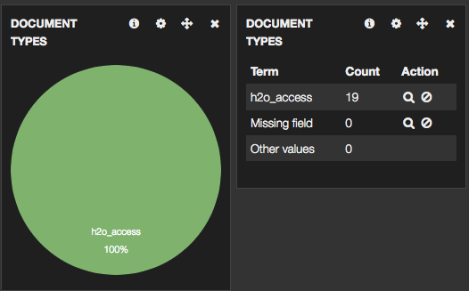
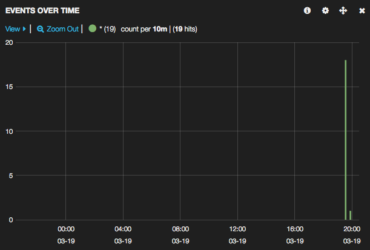
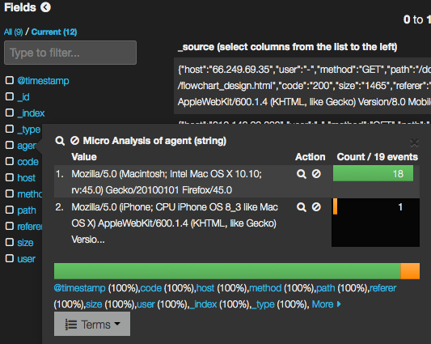

# はじめに
個人サイトをやり始めてどういったページにアクセス集中するかなど
アクセス状態を可視化できたらいいなと思ったので実践してみたという話です。

# どういったふうに可視化できたのか

Kibanaの設定をデフォルトのままという前提で話を進めていきます。

## アクセスカウントが「見える」ようになった



上記の図はKibanaのSample Dashboardから確認できたものです。
fluentdの設定でリアルタイムにアクセスログからアクセスカウントが見れるようになりました。
fluentdの設定によってはSSHしようとしているカウントも取れそうです。

## アクセスした時間が可視化された



こちらはLogstash Dashboardから確認できるものになります。
ViewのIntervalから表示されている日時の領域幅を狭めたり、広くしたりできます。

## アクセスしたユーザ情報が可視化された



こちらもLogstash Dashboardから確認できるものになります。
ホスト名であったりユーザエージェントなどがグラフ化します。

# 使用したソフトウェアと環境構築

* [Kibana](https://www.elastic.co/products/kibana)

JSONデータを解析してグラフを作成するソフトウェア
使い道がいろいろありそうだ。

インストール

```
$ curl -L -O https://download.elasticsearch.org/kibana/kibana/kibana-3.1.0.tar.gz
$ tar zxvf kibana-3.1.0.tar.gz
```

KibanaでElasticsearchの情報を見たいため
解凍したディレクトリ内にある設定ファイルの変更を行う

``` config.js
elasticsearch: "http://localhost:9200",
```

KibanaはWebによるGUIなのでWebサーバの起動が必要。
解凍したディレクトリをDocumentRoot指定してサーバ起動を行うこと。

Webサーバ(H2O)の設定

``` kibanahttp.conf
hosts:
 "example.com":
    listen: 10090
    paths:
        /:
         file.dir: /root/kibana-3.1.0

access-log: /root/kibanaaccess-log
error-log: /root/kibanaerror-log
pid-file: /root/kibanapid-file

```

iptablesのポート指定を忘れずに

* [Elasticsearch](https://www.elastic.co/products/elasticsearch)

RESTful APIを提供してくれるソフトウェア
今回ならばアクセスログをJSONにしてKibanaで見れるようにする繋ぎ役をしている。
なお、ElasticsearchはJavaを必要とする。

インストール
yumのレポジトリを追加を行う

``` /etc/yum.repos.d/elasticsearch.repo
[elasticsearch-1.1]
name=Elasticsearch repository for 1.1.x packages
baseurl=http://packages.elasticsearch.org/elasticsearch/1.1/centos
gpgcheck=1
gpgkey=http://packages.elasticsearch.org/GPG-KEY-elasticsearch
enabled=1
```

```
yum install elasticsearch
```

Elasticsearchの起動

```
service elasticsearch start
```

* [Fluentd](http://www.fluentd.org/)

あらゆるイベント・変更を見て情報を転送するソフトウェア
ログの情報をElasticsearchに反映するために使用している。
fluentdは様々なプラグインが提供されており gem で取得できる。
gemを使用するためRubyインストールすることが必須になる。

インストール

```
$ curl -L https://toolbelt.treasuredata.com/sh/install-redhat-td-agent2.sh | sh
# fluentdのプラグインをインストール
$ td-agent-gem install fluent-plugin-elasticsearch
```

インストール後、fluentdの設定ファイルを編集する
設定ファイルのオプションについては後日記載

``` /etc/td-agent/td-agent.conf
<source>
  type tail    
  format apache    # H2Oのアクセスログがapacheと似ていたためapacheで設定
  path /root/access.log    # H2Oで出力されているアクセスログファイル
  pos_file /var/log/td-agent/access.pos
  tag h2o.access
</source>

<match h2o.access>
  type elasticsearch
  host localhost
  port 9200    # デフォルトではElasticsearchが9200で起動している
  type_name h2o_access
  logstash_format true
</match>

```

Fluentd起動

```
service td-agent start
```

もしtd-agent startが失敗する場合は
/var/log/td-agent/td-agent.log
を参照すること

# 参考サイト

* [CentOS 6.5 (Vagrant)に fluentd + elasticsearch + kibana をセットアップする | もふもふ技術部](http://j-caw.co.jp/blog/?p=1380)
* [fluentd × Elasticsearch × kibanaによるアクセスログ解析](http://qiita.com/oikyn/items/f3e624b3cfd03b5cdb87)
