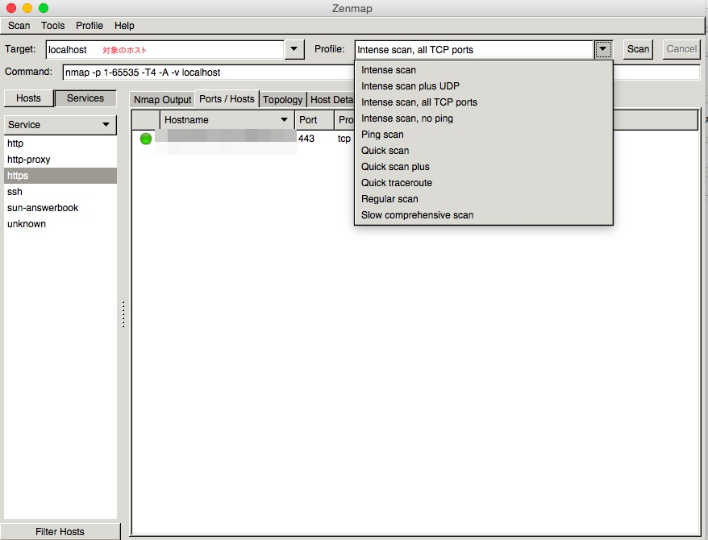

# この記事の内容

リモートのサーバで使用されているポートの調査を行うためのメモになります。

デフォルトで設定されているポートの設定について代表的なものだと
HTTP 80、HTTPS 443、SSH 22
だったりしますが、1つのサーバに複数のHTTPを立てたり、SSHがデフォルトのポートに設定されていないということがあるかと思います。

# Zenmap
[Zenmap](https://nmap.org/zenmap/)

nmapというコマンドの結果をGUIで表示してくるツールです。

nmapについて概要
[https://nmap.org/man/jp/](https://nmap.org/man/jp/)より引用

> Nmap (“Network Mapper”)は、ネットワーク調査およびセキュリティ監査を行うためのオープンソースのツールである。大規模ネットワークを高速でスキャンするように設計されているが、単一のホストに対してもまったく問題なく機能する。Nmapは生の(raw)IPパケットを用いて、ネットワーク上でどのようなホストか利用可能になっているか、これらのホストが提供しているサービス(アプリケーション名とバージョン)は何か、ホストが実行しているOS(OS名とバージョン)は何か、どのような種類のパケットフィルタ/ファイアウォールが使用されているかなど、その他数多くの特徴を斬新な方法で判別する。Nmapは、セキュリティ監査用に広く利用されているばかりでなく、ネットワーク・インベントリ(資産情報収集)、サービスのアップグレード予定管理、ホストやサービスのアップタイム(利用可能時間)の監視等の日常業務にNmapを役立てているシステム管理者やネットワーク管理者も多い。

# 使い方は簡単

Target　に対象のホストを入力して、Profileを「Intense scan, all TCP ports」にしてスキャンを開始を行えば対象のサーバの使用されているポートを調べることができます。

