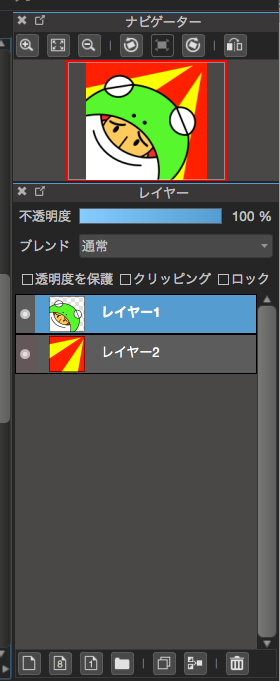
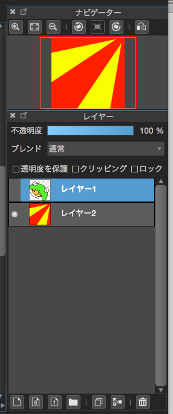
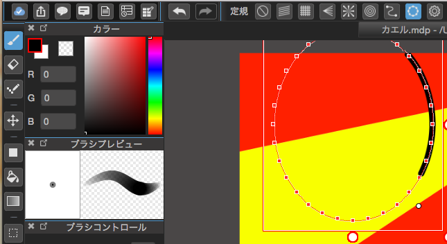
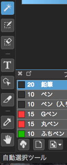
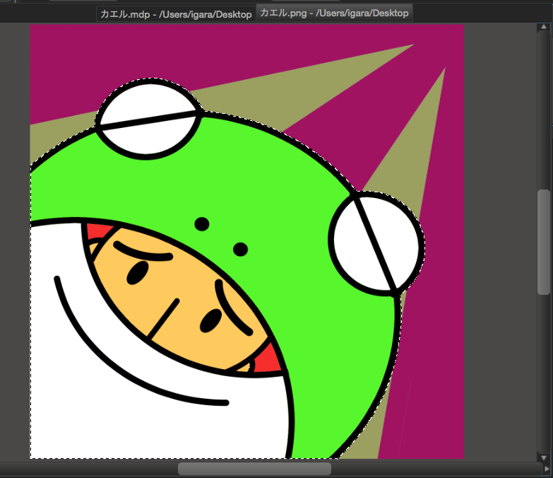
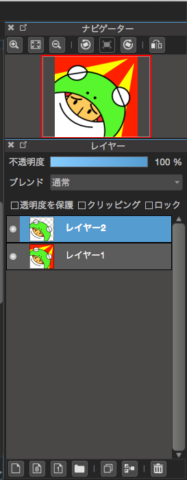

# 概要
筆者は仕事でPCを用いてプログラムしたりExcel使ったりインターネットしてたりしますが、あまりペイントツールを用いて画像の編集であったり、もしくは新しいデザインを作るということがないのでちょっと勉強がてらに絵を描いてみたという話になります。

こんなアイコン画像を作ってみた

# 使ったソフト

[MediBangPaintPro](http://medibangpaint.com/)
メディバンペイントと読みます。
Windows、Macにも対応しているようです。

このソフトで絵を描こうとした理由ですが
この手のツールの良さをまだ吟味したわけではないので特に理由はありません。
ただMac版のGimpやKritaはバグが多いような気が...

どのくらい互換性があるか未知ですがメディバンはPhotoShopで作成されるPSDファイルを読み込むことが可能のようです。

# 機能

上記のアイコン画像を作成した時の機能になります。

## レイヤー

1枚の画像を作る為にサンドイッチの構造のように絵を重ねて作ることができます。
上記の画像では背景画像と別の画像を分けて構成しています。
使用しないレイヤーの時はレイヤー名の左横にある●を押して消すことで非表示できます。

## 定規

円形や平行線であったり定規の線からはみ出ないように線を引くことができる機能です。

アイコンの絵はペンタブを使わずに定規の機能で描いた絵です。

## 切り取り

もしレイヤー分けがされていない画像のとき一部だけ取り除きたい場合があるかと思います。
いろいろな機能を合わせて行う技になりますが、輪郭がしっかりしていれば比較的に簡単に抜き取ることが可能です。
手順として下記になります。

1.自動選択ツールを使用します。

2.切り抜きたい範囲を選択していきます。

切り抜きたい箇所が複数ある場合は「Shift」を押しながらクリックすることで選択できる箇所が増えます。

3.コピーする
「Ctrl + C」もしくは「Command + C」

4.レイヤー上で貼り付ける
「Ctrl + V」もしくは「Command + V」
これで別のレイヤーに切り抜いたものを配置することができます。

# 所感・感想

簡単なサイトのデザイン画像とかも定規機能を使えばすぐに作れそう
こういったツールの使い方とか割と一般の人でも需要ありそう！
