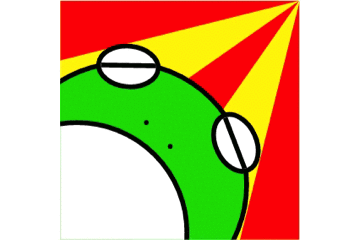
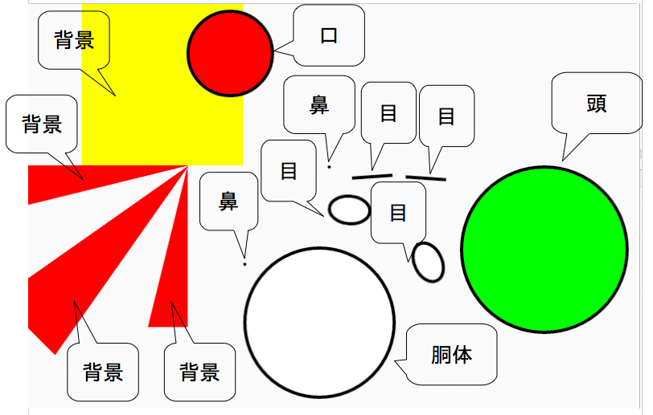
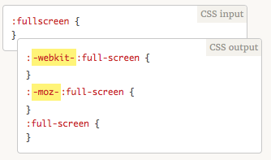

# 内容

非イラストレータが初めてPCでイラストを描いた話
http://qiita.com/igara/items/3a8dfad331652b632eff
> 新しいデザインを作るということがないのでちょっと勉強がてらに絵を描いてみたという話になります。

前回描いた絵からの教訓で簡単なイラストだったら画像を使わずにCSSで表示可能なのでは？と思った為実践してみたというお話になります。

記事の前半ではCSSの内容について、後半ではPostCSSの導入について記載させていただきます。

# 絵

こんなものができあがってしまった



実物として下記のリンクにあります。

https://syonet.work/documents/styleguide/resources-assets-styleguide-css-symbol-myicon-icon-garasyo.html

# 絵の一部をパーツに置き換えて考える

下記の画像のようにパーツを構成します。



それぞれの図形は複雑ではないです。

# コード内容

パーツ化したものをHTML、CSS化にしてみた内容になります。
背景の赤い部分など実際は黄色い背景より大きいのですが、
` overflow: hidden; `を用いてはみ出ないようにしていたり、
三角形を作成するために` border `を用いたり無茶苦茶なことをやっていますが完成したものとして下記のものになります。


## HTML

```HTML
<div class="myIconImage">
  <div class="myIconImage-background-topTriangle"></div>
  <div class="myIconImage-background-midddleTriangle"></div>
  <div class="myIconImage-background-rightTriangle"></div>
  <div class="myIconImage-character-head"></div>
  <div class="myIconImage-character-lefteye">
    <div class="myIconImage-character-lefteye-line"></div>
  </div>
  <div class="myIconImage-character-righteye">
    <div class="myIconImage-character-righteye-line"></div>
  </div>
  <div class="myIconImage-character-leftnose"></div>
  <div class="myIconImage-character-rightnose"></div>
  <div class="myIconImage-character-body">
    <div class="myIconImage-character-body-mouth"></div>
  </div>
</div>
```

## CSS

```CSS
:root{
  --ratio: 3;
  --route2: 1.41421356237;
}
.myIconImage {
  width: calc(100px * var(--ratio));
  height: calc(100px * var(--ratio));
  background-color: yellow;
  position: relative;
  overflow: hidden;
}
.myIconImage-background-topTriangle {
  border-right: calc(100px * var(--ratio)) solid transparent;
  border-bottom: calc(25px * var(--ratio)) solid transparent;
  border-left: calc(100px * var(--ratio)) solid red;
  position: absolute;
}
.myIconImage-background-midddleTriangle {
  margin-top: calc(-25px * var(--ratio));
  margin-left: calc(-100px * var(--route2) * var(--ratio) + 100px * var(--ratio));
  border-top: calc(25px * var(--ratio)) solid transparent;
  border-bottom: calc(25px * var(--ratio)) solid transparent;
  border-right: calc(100px * var(--route2) * var(--ratio)) solid transparent;
  border-left: calc(100px * var(--route2) * var(--ratio)) solid red;
  transform: rotate(-45deg);
  position: absolute;
}
.myIconImage-background-rightTriangle {
  margin-top: calc(-25px / 2 * var(--ratio));
  margin-left: calc(-25px / 2 * var(--ratio));
  border-top: calc(25px * var(--ratio)) solid transparent;
  border-right: calc(100px * var(--ratio)) solid transparent;
  border-left: calc(100px * var(--ratio)) solid red;
  transform: rotate(-90deg);
  position: absolute;
}
.myIconImage-background-rightTriangle {
  margin-top: calc(-25px / 2 * var(--ratio));
  margin-left: calc(-25px / 2 * var(--ratio));
  border-top: calc(25px * var(--ratio)) solid transparent;
  border-right: calc(100px * var(--ratio)) solid transparent;
  border-left: calc(100px * var(--ratio)) solid red;
  transform: rotate(-90deg);
  position: absolute;
}
.myIconImage-character-head {
    margin-top: calc(25px * var(--ratio));
    margin-left: calc(-25px * var(--ratio));
    height: calc(100px * var(--ratio));
    width: calc(100px * var(--ratio));
    border-radius: 100%;
    -moz-border-radius: 100%;
    -webkit-border-radius: 100%;
    border: calc(2px * var(--ratio)) solid black;
    background: lime;
    position: absolute;
}
.myIconImage-character-lefteye {
    margin-top: calc(18px * var(--ratio));
    margin-left: calc(15px * var(--ratio));
    height: calc(15px * var(--ratio));
    width: calc(23px * var(--ratio));
    border-radius: 50%;
    -moz-border-radius: 50%;
    -webkit-border-radius: 50%;
    border: calc(2px * var(--ratio)) solid black;
    background: white;
    position: absolute;
    transform: rotate(5deg);
    overflow: hidden;
}
.myIconImage-character-lefteye-line {
    margin-top: calc(6px * var(--ratio));
    height: calc(2px * var(--ratio));
    width: calc(25px * var(--ratio));
    background: black;
    position: absolute;
    transform: rotate(-4deg);
}
.myIconImage-character-righteye {
    margin-top: calc(50px * var(--ratio));
    margin-left: calc(60px * var(--ratio));
    height: calc(15px * var(--ratio));
    width: calc(23px * var(--ratio));
    border-radius: 50%;
    -moz-border-radius: 50%;
    -webkit-border-radius: 50%;
    border: calc(2px * var(--ratio)) solid black;
    background: white;
    position: absolute;
    transform: rotate(65deg);
    overflow: hidden;
}
.myIconImage-character-righteye-line {
    margin-top: calc(7px * var(--ratio));
    height: calc(2px * var(--ratio));
    width: calc(25px * var(--ratio));
    background: black;
    position: absolute;
    transform: rotate(4deg);
}
.myIconImage-character-leftnose {
    margin-top: calc(50px * var(--ratio));
    margin-left: calc(35px * var(--ratio));
    height: calc(2px * var(--ratio));
    width: calc(2px * var(--ratio));
    border-radius: 100%;
    -moz-border-radius: 100%;
    -webkit-border-radius: 100%;
    background: black;
    position: absolute;
}
.myIconImage-character-rightnose {
    margin-top: calc(60px * var(--ratio));
    margin-left: calc(45px * var(--ratio));
    height: calc(2px * var(--ratio));
    width: calc(2px * var(--ratio));
    border-radius: 100%;
    -moz-border-radius: 100%;
    -webkit-border-radius: 100%;
    background: black;
    position: absolute;
}
.myIconImage-character-body {
    margin-top: calc(50px * var(--ratio));
    margin-left: calc(-40px * var(--ratio));
    height: calc(90px * var(--ratio));
    width: calc(90px * var(--ratio));
    border-radius: 100%;
    -moz-border-radius: 100%;
    -webkit-border-radius: 100%;
    border: calc(2px * var(--ratio)) solid black;
    background: white;
    position: absolute;
    overflow: hidden;
}
.myIconImage-character-body-mouth {
    height: calc(50px * var(--ratio));
    width: calc(50px * var(--ratio));
    border-radius: 100%;
    -moz-border-radius: 100%;
    -webkit-border-radius: 100%;
    border: calc(2px * var(--ratio)) solid black;
    background: red;
    position: absolute;
    transform: rotate(180deg);
    animation-name: mouth-animation;
    animation-duration: 7s;
    animation-timing-function: ease;
    animation-iteration-count: infinite;
}
@keyframes mouth-animation {
  0% {
    margin-top: calc(-20px * var(--ratio));
    margin-left: calc(50px * var(--ratio));
  }
  50% {
    margin-top: calc(-100px * var(--ratio));
    margin-left: calc(100px * var(--ratio));
  }
  100% {
    margin-top: calc(-20px * var(--ratio));
    margin-left: calc(50px * var(--ratio));
  }
}
```

# PostCSSを導入

Sassを使ったことがありませんが先にPostCSSを入門してみました。

## PostCSSについて
[PostCSS](http://postcss.org/)

Sassと同様にトランスパイルが必要なAltCSS
プラグインが充実しており、必要に応じたトランスパイルの方法が行える。
ビルドの速度が速いらしい

## 使用したプラグインについて

[Autoprefixer](https://github.com/postcss/autoprefixer)

コンパイルする前のソースを元にprefixを自動作成してくれるもの



[PreCSS](https://github.com/jonathantneal/precss)

PostCSSを使いながらSass記法が使えるもの
今回はroute2やraito（比率）の変数の使用に用いた

[cssnano](http://cssnano.co/)

トランスパイル後のCSSをminify化してくれる

## PostCSSを使用したコード

上記のコードとさほど違いはありません...
変更点として、変数がCSSのカスタムプロパティからSassの変数に変更しています。


```sass
/* 100px * 100pxのアイコンを表示する為の比率 */
$ratio: 3;
/* ルート2の数値 */
$route2: 1.41421356237;

/* アイコンを表示する領域 */
.myIconImage {
  width: calc(100px * $ratio);
  height: calc(100px * $ratio);
  background-color: yellow;
  position: relative;
  overflow: hidden;
}
/* 上部に表示している赤い三角形 */
.myIconImage-background-topTriangle {
  border-right: calc(100px * $ratio) solid transparent;
  border-bottom: calc(25px * $ratio) solid transparent;
  border-left: calc(100px * $ratio) solid red;
  position: absolute;
}
/* 真ん中に表示している赤い三角形 */
.myIconImage-background-midddleTriangle {
  margin-top: calc(-25px * $ratio);
  margin-left: calc(-100px * $route2 * $ratio + 100px * $ratio);
  border-top: calc(25px * $ratio) solid transparent;
  border-bottom: calc(25px * $ratio) solid transparent;
  border-right: calc(100px * $route2 * $ratio) solid transparent;
  border-left: calc(100px * $route2 * $ratio) solid red;
  transform: rotate(-45deg);
  position: absolute;
}
/* 右端に表示している赤い三角形 */
.myIconImage-background-rightTriangle {
  margin-top: calc(-25px / 2 * $ratio);
  margin-left: calc(-25px / 2 * $ratio);
  border-top: calc(25px * $ratio) solid transparent;
  border-right: calc(100px * $ratio) solid transparent;
  border-left: calc(100px * $ratio) solid red;
  transform: rotate(-90deg);
  position: absolute;
}
/* カエルの頭部分 */
.myIconImage-character-head {
    margin-top: calc(25px * $ratio);
    margin-left: calc(-25px * $ratio);
    height: calc(100px * $ratio);
    width: calc(100px * $ratio);
    border-radius: 100%;
    -moz-border-radius: 100%;
    -webkit-border-radius: 100%;
    border: calc(2px * $ratio) solid black;
    background: lime;
    position: absolute;
}
/* アイコンの左側に表示している目 */
.myIconImage-character-lefteye {
    margin-top: calc(18px * $ratio);
    margin-left: calc(15px * $ratio);
    height: calc(15px * $ratio);
    width: calc(23px * $ratio);
    border-radius: 50%;
    -moz-border-radius: 50%;
    -webkit-border-radius: 50%;
    border: calc(2px * $ratio) solid black;
    background: white;
    position: absolute;
    transform: rotate(5deg);
    overflow: hidden;
}
/* アイコンの左側に表示している目の線 */
.myIconImage-character-lefteye-line {
    margin-top: calc(6px * $ratio);
    height: calc(2px * $ratio);
    width: calc(25px * $ratio);
    background: black;
    position: absolute;
    transform: rotate(-4deg);
}
/* アイコンの右側に表示している目 */
.myIconImage-character-righteye {
    margin-top: calc(50px * $ratio);
    margin-left: calc(60px * $ratio);
    height: calc(15px * $ratio);
    width: calc(23px * $ratio);
    border-radius: 50%;
    -moz-border-radius: 50%;
    -webkit-border-radius: 50%;
    border: calc(2px * $ratio) solid black;
    background: white;
    position: absolute;
    transform: rotate(65deg);
    overflow: hidden;
}
/* アイコンの右側に表示している目の線 */
.myIconImage-character-righteye-line {
    margin-top: calc(7px * $ratio);
    height: calc(2px * $ratio);
    width: calc(25px * $ratio);
    background: black;
    position: absolute;
    transform: rotate(4deg);
}
/* アイコンの左側に表示している鼻 */
.myIconImage-character-leftnose {
    margin-top: calc(50px * $ratio);
    margin-left: calc(35px * $ratio);
    height: calc(2px * $ratio);
    width: calc(2px * $ratio);
    border-radius: 100%;
    -moz-border-radius: 100%;
    -webkit-border-radius: 100%;
    background: black;
    position: absolute;
}
/* アイコンの右側に表示している鼻 */
.myIconImage-character-rightnose {
    margin-top: calc(60px * $ratio);
    margin-left: calc(45px * $ratio);
    height: calc(2px * $ratio);
    width: calc(2px * $ratio);
    border-radius: 100%;
    -moz-border-radius: 100%;
    -webkit-border-radius: 100%;
    background: black;
    position: absolute;
}
/* カエルの胴体 */
.myIconImage-character-body {
    margin-top: calc(50px * $ratio);
    margin-left: calc(-40px * $ratio);
    height: calc(90px * $ratio);
    width: calc(90px * $ratio);
    border-radius: 100%;
    -moz-border-radius: 100%;
    -webkit-border-radius: 100%;
    border: calc(2px * $ratio) solid black;
    background: white;
    position: absolute;
    overflow: hidden;
}
/* カエルの口 */
.myIconImage-character-body-mouth {
    height: calc(50px * $ratio);
    width: calc(50px * $ratio);
    border-radius: 100%;
    -moz-border-radius: 100%;
    -webkit-border-radius: 100%;
    border: calc(2px * $ratio) solid black;
    background: red;
    position: absolute;
    transform: rotate(180deg);
    animation-name: mouth-animation;
    animation-duration: 7s;
    animation-timing-function: ease;
    animation-iteration-count: infinite;
}
/* 口のアニメーション */
@keyframes mouth-animation {
  0% {
    margin-top: calc(-20px * $ratio);
    margin-left: calc(50px * $ratio);
  }
  50% {
    margin-top: calc(-100px * $ratio);
    margin-left: calc(100px * $ratio);
  }
  100% {
    margin-top: calc(-20px * $ratio);
    margin-left: calc(50px * $ratio);
  }
}
```

# 参考ページ
なぜCSSのborderで三角形ができるのか、実際にコードを書いて調べてみた
http://liginc.co.jp/web/html-css/html/164641
次世代CSS登場！PostCSSの簡単な使い方
http://designup.jp/postcss-how-to-use-438/
PostCSSとcssnextで最新CSS仕様を先取り！
https://html5experts.jp/t32k/17235/
