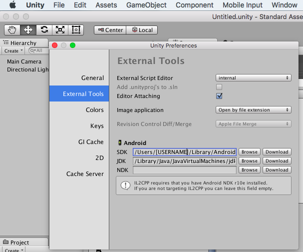
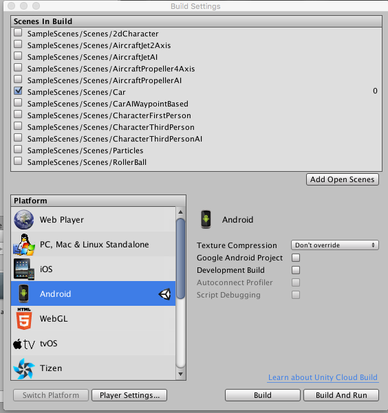
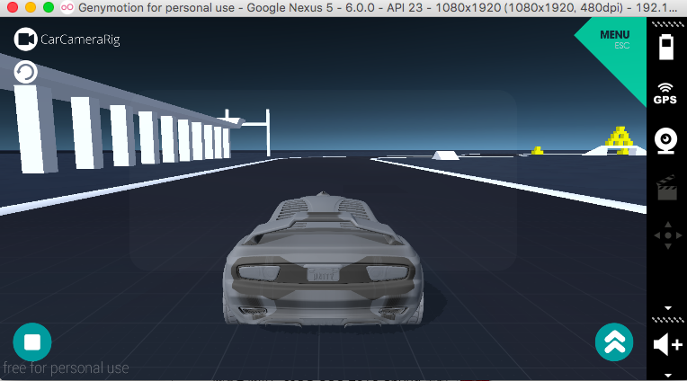
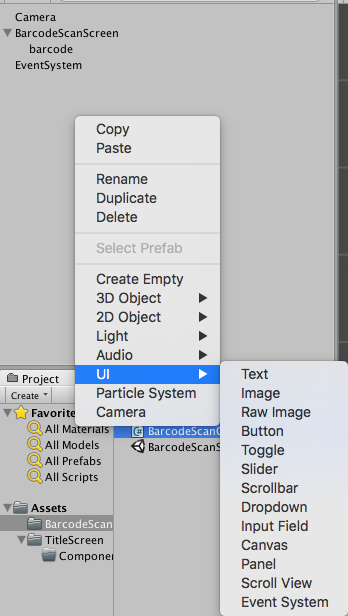

# 概要

今後UnityでAndroid・iOSアプリ両方を作っていきたいということがあり、
いざやってみようとしたらUnity以外に必要なものがあったため
メモとして記載する。
なお対象のプロジェクトはデフォルトで用意されているStandardプロジェクトで行う。

# 必要なもの

Unityはインストールされている前提で記載します。
Androidのビルドに必要なものになります。

下記のものがインストールされたらUnityのメニューバーより
「 Unity → Preferences 」 External Tools を選択してパスの設定を行います。

## Android　SDK

Unityの公式で記載されている内容としては下記になります。
http://docs.unity3d.com/ja/current/Manual/android-sdksetup.html

Android Studioをインストールされていて既にAndroid　SDKが存在するとき
/Users/[ユーザ名]/Library/Android/sdk/
ここにAndroid　SDKが設置されます。

## JDK

既存でjdkがインストールされているときは下記のパスになります。
/Library/Java/JavaVirtualMachines/jdk1.7.X_XX.jdk/Contents/Home

# ビルドの実行

Androidのエミュレータとして[Genymotion](https://www.genymotion.com/)というのがありますがこちらのエミュレータはAndroid SDKからのエミュレータ起動より早いためこちらを事前に起動しておくと良いかもしれません。

https://www.genymotion.com/

Unityのメニューバーより
「 File → Build Settings 」
PlatformからAndroidを選択し、「Build & RUN」を行うとビルドが開始されます。

しばらくするとGenymotionで起動したエミュレータ上にアプリケーションが起動されます。

# 新規のプロジェクトからAndroidアプリを起動しよう

Unityによる画面作成は「canvas」から行います。
Hierarchy ウィンドウから「Create　→ UI」より「canvas」を選択して画面を作成します。

それからそのあと「Command + S」で保存を行い、「Build & RUN」でUnityのロゴが表示されるかと思われます。

次回画面の作りについて記載したいと思います。
