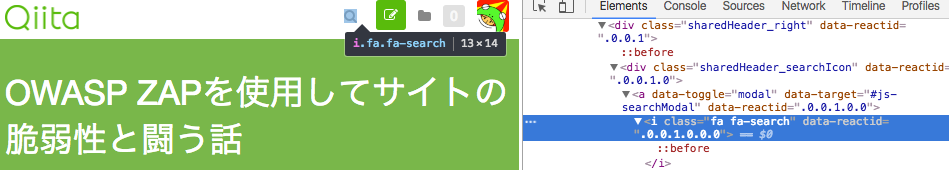
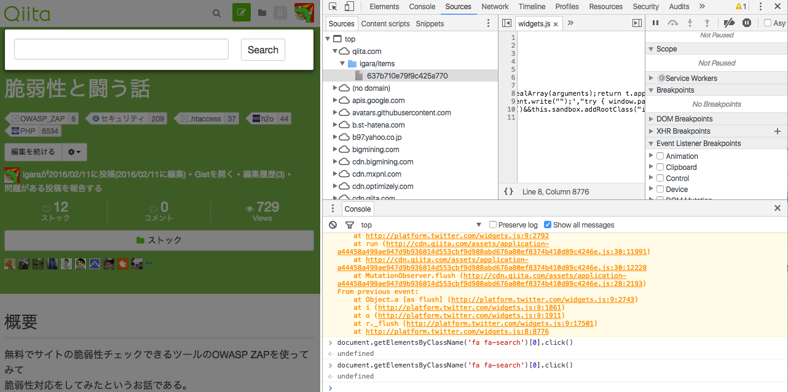
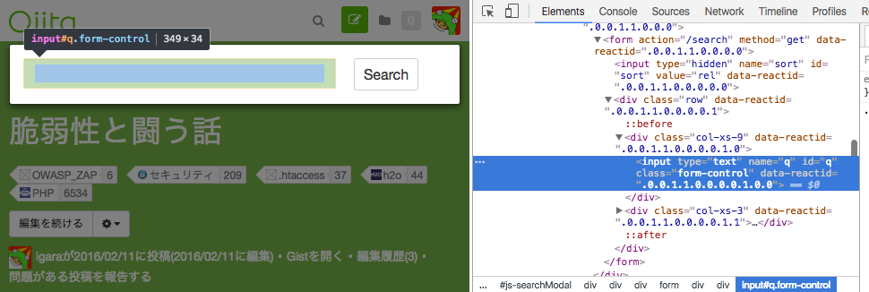
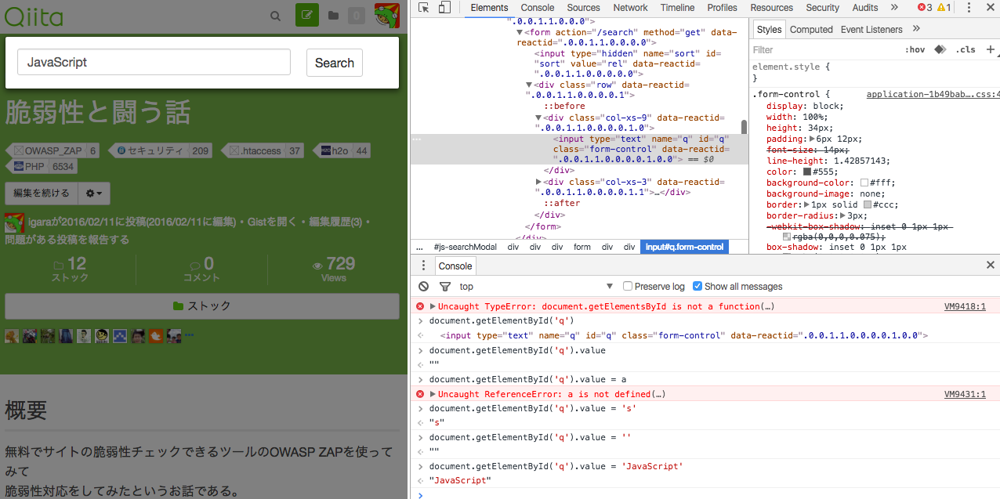
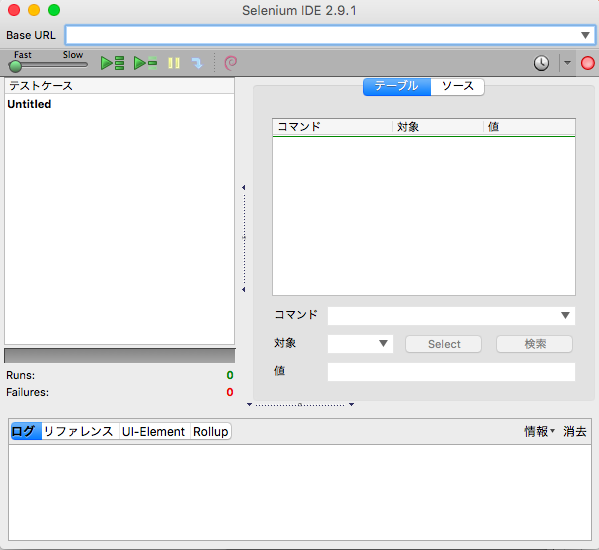
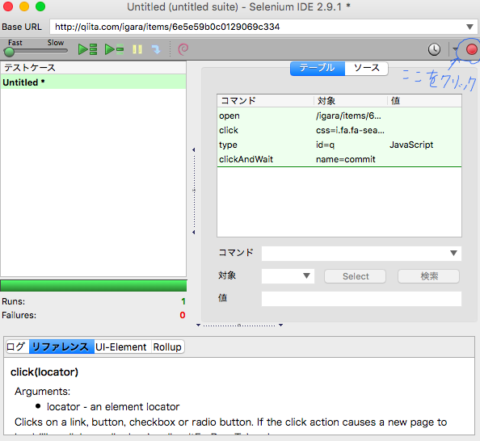

# 内容

**「おまえは今まで作ったアカウント数をおぼえているのか？」**

仕事でログイン・サインイン機能の改修があり、
新規アカウントによるテストというのが何回も行わないといけなかったということがありました。
新規アカウント作るにも電話番号であったり氏名など、入力項目が多くて辛い...
少しでも楽したい...ということでちょっとしたツールを作ってみたという話

テスト用の環境とかちゃんと整備しようよ...って気にもなりますが...

即席で入力が楽になるというやり方の紹介になります。
今回はこの画面からQiitaのキーワード検索を行ってみる例をやってみます。

2016/06/04追記
@tenkoma@github さんの紹介でFirefoxのアドオン、Selenium IDEというキーワードをいただいたので試してみましたが、
結論を言いますとSelenium IDEで自動入力するのが楽でした。
理由としては自動で行いたいことを人間の操作から自動で登録できたからです。
Selenium IDEについて下記に追記を致しました。

JavaScriptを用いてやるか、Seleniumで自動でやるかどっちがいいの？という話についてです。
JavaScriptの実装過程でここを動かせばこのスクリプトを動かしたいとか
デバッグを交えてやりたい時にJavaScriptによる半自動なやり方は有効だと思います。

Selenium IDEを使ってアカウントの作成を行った方が早かった...。

# 何はともあれ開発ツールだ（JavaScript編）

画面上部の虫眼鏡周りのHTML要素を見てみましょう。

## 虫眼鏡をクリック 



するとaタグや子の要素でiタグとかあります。
このあたりをクリックすれば検索入力のフォームが出てくるので
この中で比較的にJavaScriptでiタグのclassからHTMLの要素取得してイベント発火してみましょう。
classは複数のHTMLの要素に指定できるためプラスでどこの部分のclassを指定するのかを教えるために[0]も追記します。
それとクリックイベントを追記すれば検索フォームが出てきます。

コードとして下記になります。

虫眼鏡クリックの処理

```
document.getElementsByClassName('fa fa-search')[0].click();
```

これを開発ツールのコンソール部分に入れて実行すればフォームが出てきました。



## 文字の入力



入力箇所のところはidの指定がされているのでidの指定から入力部に値を入れてみましょう。

入力箇所の文字入力

```
document.getElementById('q').value = 'JavaScript';
```



文字が入りましたね！


## 「Search」をクリック

説明は虫眼鏡クリックだいたい同じですので省略。

「Search」をクリックする処理

```
document.getElementsByClassName('btn btn-default btn-sm')[0].click();
```

検索が実行されましたね！

## ブックマークレットを作る

先ほど作成していったJavaScriptをブックマーク化します。
その時に登録するURLの部分を下記のようにして登録を行います。

```
javascript:document.getElementsByClassName('fa fa-search')[0].click();document.getElementById('q').value = 'JavaScript';document.getElementsByClassName('btn btn-default btn-sm')[0].click();
```

あとはブックマーク一覧からこの作成されたものをクリックするだけで
Qiitaのページの要素やイベントを使って検索を半自動で行えるようになります。

# Selenium IDE

https://addons.mozilla.org/ja/firefox/addon/selenium-ide/

FirefoxのアドオンとしてSelenium IDEがあります。
Selenium自体は他のブラウザにもWebDriverというのをインストールしてあげれば使用することができますが、
今回はこのアドオン利用してやった方がアカウント作成するまでにかかる時間が少なかったため、
アドオンの紹介だけします。

## まずはFirefoxとアドオンをインストール

表題通りです。

## Selenium IDEを使う

メニューバーから「ツール」→「Selenium IDE」を選択。
こんな今感じのが出てくるかと思います。



URLのとこに対象のURLを入れます。

そしたら下記の画像の「ここをクリック」を押してみましょう。
これでFirefox上のユーザの操作を記憶できるようになります。



操作を行いSelenium上で扱うコマンドを自動で作成されたら、を押せば自動に入力などの操作が行われます。
