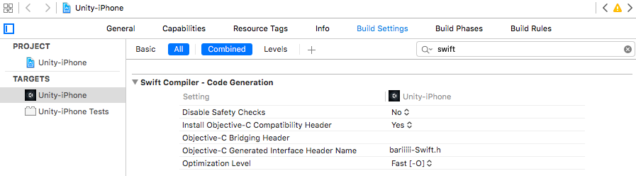
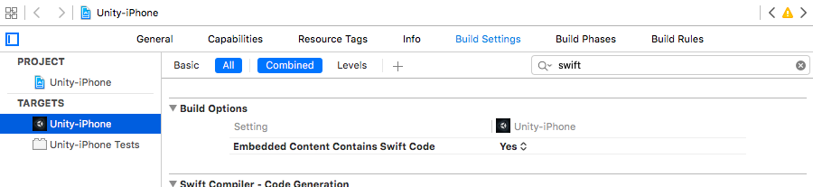
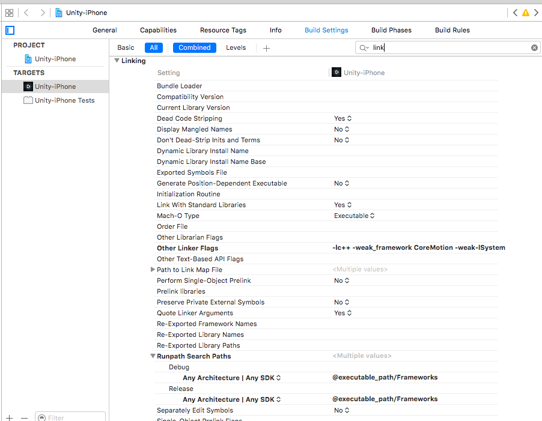

# 内容

Unityで一部の処理をiOSのネイティブコードで書きたい時があるかと思います。
尚且つiOSであるならばSwiftで書きたいということもあるかと思います。
その時に実際にやってみてはまったことを書き残します。


私の場合はUnityアプリケーション上で動くWebカメラではなく、iOSのAVFoundationライブラリ使ってカメラモジュールを動かしバーコードの読み取りを行いたいという時にここの箇所をSwiftで書ければなぁ...ということがありました。

# ネイティブコードを書いてみて呼び出してみよう！

## サンプルコード

先にC#上で外部のファイルを呼び出す処理について記載します。
C#には[DllImport属性](https://msdn.microsoft.com/ja-jp/library/aa288468(v=vs.71).aspx)を指定することで外部のdllを読み込むことができ、
[extern修飾子](https://msdn.microsoft.com/ja-jp/library/e59b22c5.aspx)というのでネイティブコード上のメソッドや変数を指定します。

下記はネイティブコードを呼び出すためにC#で記載したクラスファイルです。

``` HogeClass.cs
using UnityEngine;
using System.Runtime.InteropServices;

public class HogeClass {
    [DllImport("__Internal")]    // Unityで提供されているネイティブプラグイン
	private static extern void hogeMethod_ ();    // ネイティブコード上のメソッド

	public static void hogeMethod () {
		if (Application.platform != RuntimePlatform.OSXEditor) {
			hogeMethod_ ();    // ネイティブコード上のメソッドを呼び出す
		}
    }
}
```

ただしC#から直接Swiftのコードを読み込むことができないため
Objective-Cで記載したコードを経由してSwiftのコードを読みに行きましょう。

``` HogeClass.mm
#import <UIKit/UIKit.h>
#import <[Unityのプロジェクト名]-Swift.h>

extern "C"{
    void hogeMethod_() {
         [HogeClass hogeMethod];    // Swiftのメソッドを呼び出す
    }
}
```

ここの

```
#import <[Unityのプロジェクト名]-Swift.h>
```

ですが
Objective-C Generated Interface Header Name
に記載されているのを指定してあげてください。



[Unityのプロジェクト名]-Swift.hの生成方法ですが
下記にまとめて記載します。（今回一番はまったところです。）


いよいよSwiftのコードの記載です。


``` HogeClass.swift
import UIKit

public class HogeClass: NSObject {
    public class func hogeMethod() {
        print("hoge")    // Xcodeのコンソール上にhogeと表示させる
    }
}

```

これでSwiftのコードを読み込むためのコーディング完了です。

## [Unityのプロジェクト名]-Swift.hの生成方法

Embedded Content Contains Swift Code　というとこをYesにすることでSwiftのコードがヘッダファイルとして生成されます。



あとObjective-CからSwiftを呼びだそうとすると

```
dyld: Library not loaded: @rpath/libswiftCore.dylib
Referenced from: /private/var/mobile/Containers/Bundle/Application/XXXXXXXX-XXXX-XXXX-XXXX-XXXXXXXXXXXX/App-Name.app/App-Name
Reason: image not found
```

というエラーが出てきてしまいます。
これの解決方法としてRunpath Search Pathに@executable_path/Frameworksを追加してあげることでUnity上でObjective-Cを経由しながらSwiftの処理を動かすことができるようになります。




# 参考リンク
KAKELOG / Unity iOS のネイティブプラグインを Swift で書いた
http://blog.kakeragames.com/2016/05/07/unity-swift.html
Objective-cからSwiftを呼び出す方法
http://qiita.com/syou007/items/b0c54d795d63fb84de72
UnityのスクリプトからのiOSのネイティブプラグインとのやりとり
http://qiita.com/tyfkda/items/dc5da219d22cc55de301
Swiftで書かれたiOSアプリを実機デバッグ実行時に「image not found」エラーとなる場合の対処
http://raimon49.github.io/2016/03/20/error-at-swift-app-with-ios-device.html
テラシュールブログ / 
UnityのC#からネイティブプラグインを経由せずObjective-Cのコードを呼び出す
http://tsubakit1.hateblo.jp/entry/2014/08/14/022012
