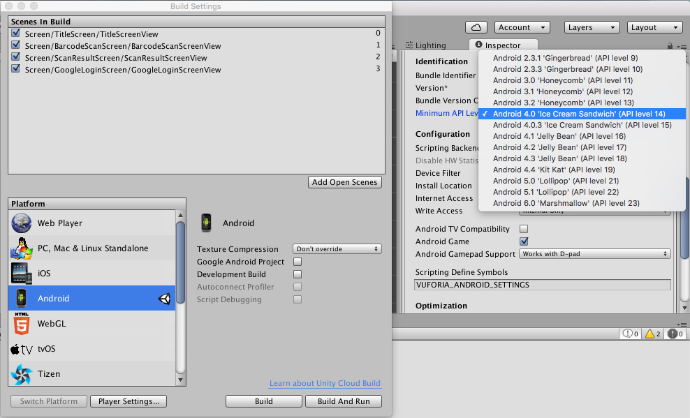
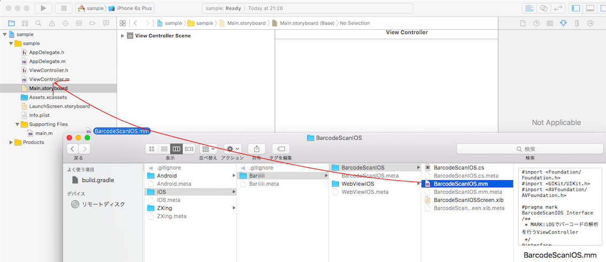

# この記事の内容について
前回UnityでSwiftで書いたiOSのネイティブコードを使う方法について記載しました。

- [UnityのネイティブコードをSwiftで書こうとした時にはまったこと](http://qiita.com/igara/items/68b4d3efd53c118339b3)

（実際やってみるとUnityでビルドする度にXcode上の設定が戻ってしまって辛い問題が...）

その後Androidのネイティブコードも書いてみてiOSとAndroidのプロジェクト構成に違いが出たなぁということでメモ書きです。

# 対象のプロジェクトの簡単な説明

- [Bariiiii](https://github.com/igara/Bariiiii/tree/f25487a98531cd2eb27a294ab928a1976d933a55)
Assets、ProjectSettingsは
Unityプロジェクトで使用されるものです。

    - [CreateBariiiiiAndroidNativePlugin](https://github.com/igara/Bariiiii/tree/f25487a98531cd2eb27a294ab928a1976d933a55/CreateBariiiiiAndroidNativePlugin)  
    このプロジェクトはAndroid Studioで作成されており、  
    このプロジェクトでビルドで作成されたjarファイルやaarファイルをGradlew経由で[/Assets/Plugins/Android](https://github.com/igara/Bariiiii/tree/f25487a98531cd2eb27a294ab928a1976d933a55/Assets/Plugins/Android)にimportさせます。
    - [CreateBariiiiiIOSNativePlugin](https://github.com/igara/Bariiiii/tree/f25487a98531cd2eb27a294ab928a1976d933a55/CreateBariiiiiIOSNativePlugin)  
    このプロジェクトはXcodeで作成されますが、  
    対象のネイティブコードはUnity管理のディレクトリ[/Assets/Plugins/iOS/](https://github.com/igara/Bariiiii/tree/f25487a98531cd2eb27a294ab928a1976d933a55/Assets/Plugins/iOS/Bariiiii)に直接配置します。この構成を実現させるにはXcodeプロジェクト上のファイルと実ファイルの参照がちゃんとリンクさせる必要があります。
    
## 補足：そもそもUnityによるiOSとAndroidのビルドの違い
- iOS
一旦Xcodeのプロジェクトが作成されて
Xcode経由でiOS端末にアプリインストールします。

- Android
Unityの設定でAndroid SDKのパス設定が正常ならば
Unityのビルドで直接Android端末にアプリインストールします。

# Androidのプロジェクト

## ネイティブコードの配置先
Layout XML、コードなどはよくあるAndroidプロジェクトの配置と同じです。

## AndroidManifest.xml
使用したいAndroidプロジェクトのActivityや必要な権限（permission）はUnityプロジェクト側のAndroidManifest.xmlに記載します。
理由としてはUnityビルド中に他のaarファイルの中にあるAndroidManifest.xmlがマージを行いコンフリクトを起こす原因になるからです。

- Androidプロジェクト側  
[AndroidManifest.xml](https://github.com/igara/Bariiiii/blob/f25487a98531cd2eb27a294ab928a1976d933a55/CreateBariiiiiAndroidNativePlugin/app/src/main/AndroidManifest.xml)

``` /CreateBariiiiiAndroidNativePlugin/app/src/main/AndroidManifest.xml
<?xml version="1.0" encoding="utf-8"?>
<manifest xmlns:android="http://schemas.android.com/apk/res/android"
    package="work.syonet.bariiiii">

    <application
        android:allowBackup="true"
        android:icon="@mipmap/ic_launcher"
        android:supportsRtl="true"
        android:theme="@style/AppTheme">
    </application>
</manifest>
```

- Unityプロジェクト側  
[AndroidManifest.xml](https://github.com/igara/Bariiiii/blob/f25487a98531cd2eb27a294ab928a1976d933a55/Assets/Plugins/Android/AndroidManifest.xml)

``` /Assets/Plugins/Android/AndroidManifest.xml
<manifest
    xmlns:android="http://schemas.android.com/apk/res/android">
    <uses-sdk android:minSdkVersion="14" android:targetSdkVersion="23" />
    <uses-permission android:name="android.permission.CAMERA"/>
    <uses-feature android:name="android.hardware.camera"/>
    <uses-feature android:name="android.hardware.camera.autofocus"/>
    <uses-permission android:name="android.permission.INTERNET" />
    <application
        android:theme="@style/UnityThemeSelector"
        android:icon="@drawable/app_icon"
        android:label="@string/app_name">
        <activity
            android:name="com.unity3d.player.UnityPlayerNativeActivity"
            android:configChanges="fontScale|keyboard|keyboardHidden|locale|mnc|mcc|navigation|orientation|screenLayout|screenSize|smallestScreenSize|uiMode|touchscreen">
            <meta-data android:name="android.app.lib_name" android:value="unity" />
            <meta-data android:name="unityplayer.ForwardNativeEventsToDalvik" android:value="true" />
            <intent-filter>
                <action android:name="android.intent.action.MAIN" />
                <category android:name="android.intent.category.LAUNCHER" />
            </intent-filter>
        </activity>
        <activity android:name="work.syonet.bariiiii.BarcodeScanAndroidActivity"
	        android:label="@string/app_name"
	        android:configChanges="keyboard|keyboardHidden|orientation"
	        android:exported="true"
    		android:permission="android.permission.INTERNET">
	    </activity>
    </application>
</manifest>

```

## build.gradle

- Androidプロジェクト直下のbuild.gradle  
[build.gradle](https://github.com/igara/Bariiiii/blob/f25487a98531cd2eb27a294ab928a1976d933a55/CreateBariiiiiAndroidNativePlugin/build.gradle)

``` /CreateBariiiiiAndroidNativePlugin/build.gradle
// Top-level build file where you can add configuration options common to all sub-projects/modules.

buildscript {
    ext.kotlin_version = '1.0.3'
    repositories {
        jcenter()
    }
    dependencies {
        classpath 'com.android.tools.build:gradle:2.1.0'
        classpath "org.jetbrains.kotlin:kotlin-gradle-plugin:$kotlin_version"
        classpath "org.jetbrains.kotlin:kotlin-android-extensions:$kotlin_version"
    }
}

allprojects {
    repositories {
        jcenter()
    }
}

task clean(type: Delete) {
    delete rootProject.buildDir
}

```

ちょっとkotlin使いたかったのでその設定ぐらいしかしていません  

- Androidプロジェクト直下のapp/build.gradle  
[build.gradle](https://github.com/igara/Bariiiii/blob/f25487a98531cd2eb27a294ab928a1976d933a55/CreateBariiiiiAndroidNativePlugin/app/build.gradle)  

``` /CreateBariiiiiAndroidNativePlugin/app/build.gradle
apply plugin: 'com.android.library'
apply plugin: 'kotlin-android'
apply plugin: 'kotlin-android-extensions'

android {
    compileSdkVersion 23
    buildToolsVersion "24.0.2"

    defaultConfig {
        minSdkVersion 14
        targetSdkVersion 23
        versionCode 1
        versionName "1.0"
        multiDexEnabled true
    }
    buildTypes {
        release {
            minifyEnabled false
            proguardFiles getDefaultProguardFile('proguard-android.txt'), 'proguard-rules.pro'
        }
    }
    sourceSets {
        main.java.srcDirs += 'src/main/kotlin'
    }
}

// UnityのAndroidプラグインフォルダに移動させる
task copyLibs << {
    configurations.compile.each { lib ->
        if (lib.path.startsWith("${projectDir}/libs")) {
            // libs内のものはコピー対象外
            return
        }
        copy {
            from lib.path
            into '../../Assets/Plugins/Android'
        }
    }
}

dependencies {
    compile fileTree(include: ['*.jar'], dir: 'libs')
    testCompile 'junit:junit:4.12'
    compile "org.jetbrains.kotlin:kotlin-stdlib:$kotlin_version"
    compile 'com.google.android.gms:play-services-vision:9.4.0'
    // Unityのプラグイン一覧には含めない
    provided files('/Applications/Unity/PlaybackEngines/AndroidPlayer/Variations/mono/Development/Classes/classes.jar')
}

// このプロジェクトをaar化させる
task exportAar(type: Copy, dependsOn: assembleRelease) {
    from('build/outputs/aar/')
    into('../../Assets/Plugins/Android/')
    include('app-release.aar')
    rename('app-release.aar', 'bariiiii.aar')
}


android.libraryVariants.all { variant ->
    variant.outputs.each { output ->
        output.packageLibrary.exclude('libs/classes.jar')
    }
}
```

このbuild.gradleファイルで注目する点として  

- apply plugin: 'com.android.library'  
com.android.applicationから変更
- task copyLibs  
Google Play ServicesなどAndroidプロジェクトで使用していた  
ライブラリをUnity管理下にするためのバッチ
- task exportAar  
今回作成したAndroidプロジェクトをaarファイル化しUnity管理下にするバッチ  
aarファイル化させた理由としてはAndroidプロジェクト内にあるLayout XMLやstring.xmlなどもまとめてくれるからです。
- provided files('/Applications/Unity/〜〜〜〜  
Androidプロジェクト内のコードでUnityで提供されているUnitySendMessageを使用したかったからです。  
使用していた箇所として[これ](https://github.com/igara/Bariiiii/blob/f25487a98531cd2eb27a294ab928a1976d933a55/CreateBariiiiiAndroidNativePlugin/app/src/main/java/work/syonet/bariiiii/BarcodeCameraFragment.kt)になります。  
provided filesを入れないとtask copyLibsを実行した時にUnityのクラスファイルを二重に入れることになり、ビルドが通らなくなります。

### ビルド実行

```
gradlew app:copyLibs && gradlew app:exportAar
```

## Androidバージョンの指定の統一

build.gradlewやAndroidManifest.xml、UnityEditor上で指定されているminSdkVersionやtargetSdkVersionはバラツキがないように設定




## C#からAndroidプロジェクトのコードを動かすようにする

ここのやり方は公式や他のQiitaの記事でも書いてあったりしますので詳しい説明は割愛します。
ActivityLauncher.javaというkotlinじゃなくてJavaのファイルにした理由ですが特にありません。
強いて理由とすればC#とJavaって書き方似てるなぁという愉悦に浸るぐらいの程度のものです。

[CameraRawImageComponent.cs](https://github.com/igara/Bariiiii/blob/f25487a98531cd2eb27a294ab928a1976d933a55/Assets/Screen/BarcodeScanScreen/Component/CameraRawImageComponent.cs)

``` CameraRawImageComponent.cs
AndroidJavaClass unityPlayer = new AndroidJavaClass("com.unity3d.player.UnityPlayer"); 
		AndroidJavaObject currentUnityActivity = unityPlayer.GetStatic<AndroidJavaObject>("currentActivity"); 

		AndroidJavaClass plugin = new AndroidJavaClass("work.syonet.bariiiii.ActivityLauncher"); 
		plugin.CallStatic("launchActivity", "work.syonet.bariiiii.BarcodeScanAndroidActivity", currentUnityActivity );
```

[ActivityLauncher.java](https://github.com/igara/Bariiiii/blob/f25487a98531cd2eb27a294ab928a1976d933a55/CreateBariiiiiAndroidNativePlugin/app/src/main/java/work/syonet/bariiiii/ActivityLauncher.java)


``` ActivityLauncher.java
package work.syonet.bariiiii;

import android.app.Activity;
import android.content.Intent;

/**
 * C#のコードからAndroidのアクティビティにつなげるクラス
 */
public class ActivityLauncher {

    /**
     * AndroidのアクティビティにIntentを発行する
     * @param type 起動したいアクティビティ
     * @param m_activity Unity自身のアクティビティ
     */
    public static void launchActivity(String type, final Activity m_activity) {
        Intent i = new Intent();
        i.setAction(Intent.ACTION_MAIN);
        i.setClassName(m_activity, type);

        // 画面遷移を行う
        m_activity.startActivity(i);
    }
}
```


# iOSのプロジェクト

## ネイティブコードの配置先

この記事の冒頭にもありましたが/Assets/Plugins/iOS/下に配置します。
> このプロジェクトはXcodeで作成されますが、  
対象のネイティブコードはUnity管理のディレクトリ[/Assets/Plugins/iOS/](https://github.com/igara/Bariiiii/tree/f25487a98531cd2eb27a294ab928a1976d933a55/Assets/Plugins/iOS/Bariiiii)に直接配置します。この構成を実現させるにはXcodeプロジェクト上のファイルと実ファイルの参照がちゃんとリンクさせる必要があります。

iOSにもLayoutを構成するxibファイルやstoryboardなどInterface Builderで作成したもの達がありますがUnity上でも呼び出すことが可能で特別なIBの設定なども必要ありません。

### 実ファイルとXcodeプロジェクトをリンクさせる方法

まず/Assets/Plugins/iOS/下に空のクラスファイルを作成します。
あとはFinderからファイルをXcode上にドラッグアンドドロップしましょう。



これでリンクされるようになります。

## C#からiOSプロジェクトのコードを動かすようにする

ここのやり方もAndroid同様に公式や他のQiitaの記事でも書いてあったりしますので詳しい説明は割愛です。

[BarcodeScanIOS.cs](https://github.com/igara/Bariiiii/blob/f25487a98531cd2eb27a294ab928a1976d933a55/Assets/Plugins/iOS/Bariiiii/BarcodeScanIOS/BarcodeScanIOS.cs)

``` /Assets/Plugins/iOS/Bariiiii/BarcodeScanIOS/BarcodeScanIOS.cs
	[DllImport("__Internal")]
	private static extern void barcordScanInit_ ();

	public static void barcordScanInit () {
		if (Application.platform != RuntimePlatform.OSXEditor) {
			barcordScanInit_ ();
		}
    }
```

[BarcodeScanIOS.mm](https://github.com/igara/Bariiiii/blob/f25487a98531cd2eb27a294ab928a1976d933a55/Assets/Plugins/iOS/Bariiiii/BarcodeScanIOS/BarcodeScanIOS.mm)

``` /Assets/Plugins/iOS/Bariiiii/BarcodeScanIOS/BarcodeScanIOS.mm
#pragma mark called by C#
/**
 * MARK:Unity上で扱うViewController
 */
extern UIViewController *UnityGetGLViewController();

extern "C" {
    void barcordScanInit_();
}

/**
 * MARK:C#からBarcodeIOSのクラスを呼び出す
 */
void barcordScanInit_() {

    UINib *nib = [UINib nibWithNibName:@"BarcodeScanIOSScreen" bundle:nil];
    BarcodeScanIOS *barcode = [[nib instantiateWithOwner:nil options:nil] objectAtIndex:0];
    [UnityGetGLViewController() presentViewController:barcode animated:YES completion:nil];
}
```


# 今後（今

Unityプロジェクトとネイティブコードプロジェクトのビルドを楽にできるようなツールを作成中
https://github.com/igara/Bariiiii/tree/master/BuildTool
もっとiOSのビルドが楽になるようなものを作っていきたいです。

# 参考リンク
- 公式
    - [Unity - マニュアル_ Android 用のプラグインをビルド](https://docs.unity3d.com/ja/current/Manual/PluginsForAndroid.html)
    - [Unity - マニュアル_ iOS 用のプラグインをビルド](https://docs.unity3d.com/ja/current/Manual/PluginsForIOS.html)
- UnityとAndroidネイティブの連携：UnityからネイティブのActivityを呼び出す[part1] _ 未知の路  
http://redfreshet.com/2015/08/24/unity_android_link_3/
- 【Unity】こんなAndroidネイティブプラグインをつくっちゃいけない！【特に広告SDK】 - Qiita  
http://qiita.com/RyotaMurohoshi/items/3b95daeb8eaa6b487a20
