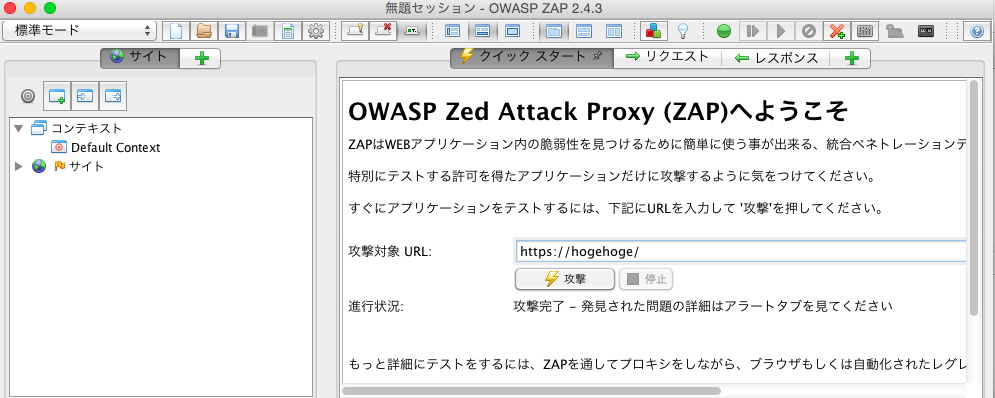
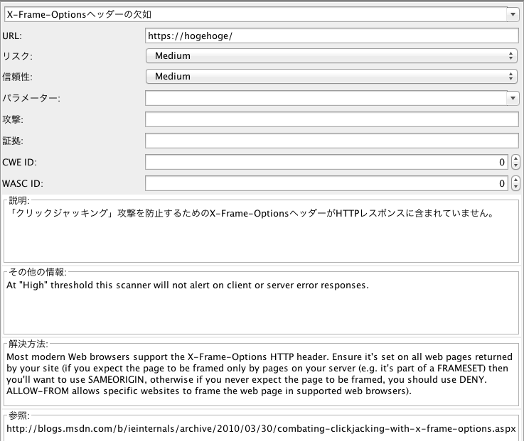
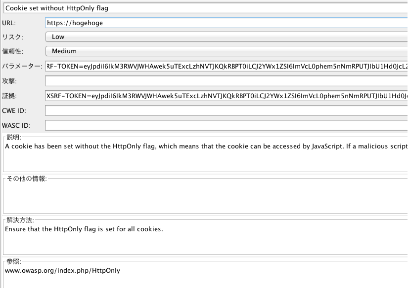
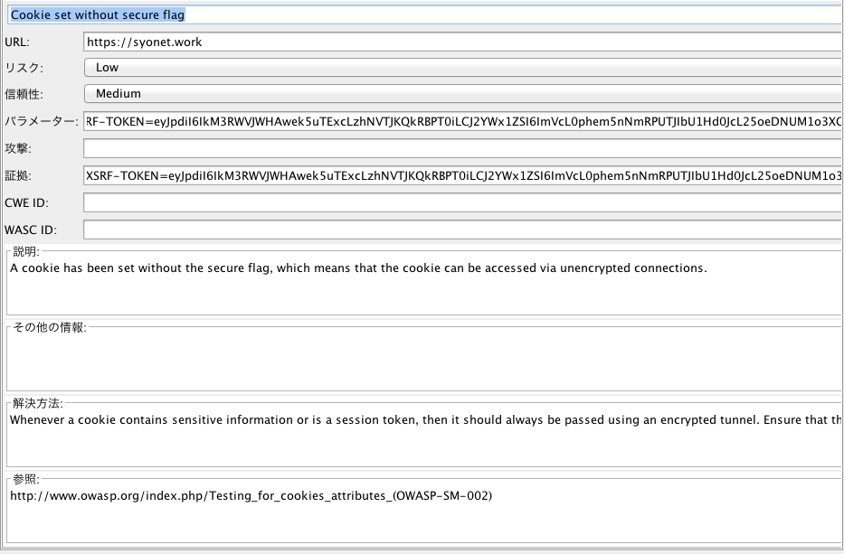
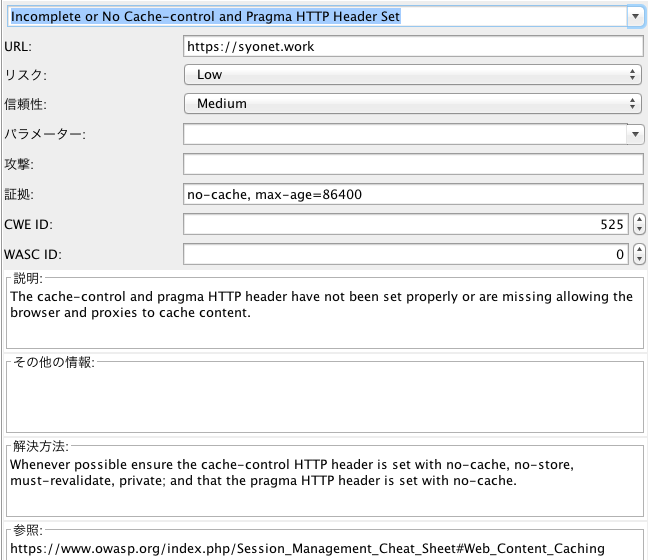
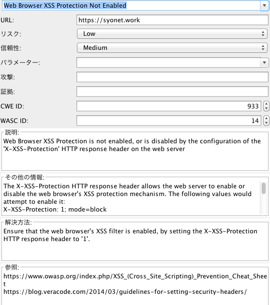

# 概要
無料でサイトの脆弱性チェックできるツールのOWASP ZAPを使ってみて
脆弱性対応をしてみたというお話である。

OWASP ZAPのダウンロードは下記
https://github.com/zaproxy/zaproxy/wiki/Downloads

# 使い方
ところどころが日本語化されているので比較的に使いやすいかもしれない
クイックスタートより攻撃対象URLを入力して攻撃！
対象のサイトがどこかの外部サイトのものやCDNなどを使用されている場合は攻撃する前にURLの指定を外したほうが良い。


# 発生した脆弱性

## X-Frame-Optionsヘッダーの欠如



「クリックジャッキング」攻撃を防止するために下記を追記することで対策できる。
他のサイトからiframeによるアクセスができないようにするために行う内容である。

.htaccessなら

```
Header set X-FRAME-OPTIONS "DENY"
```

H2Oなら

```
header.set: "X-Frame-Options: DENY"
```

PHP側で対応する場合なら

```
header("X-Frame-Options: DENY");
```

## Cookie set without HttpOnly flag


CookieのセッションIDをJS経由で取得できてしまう脆弱性があるため
Cookieのセットの設定はHttpOnlyにしよう。

.htaccessなら

```
session.cookie_httponly = On
```

H2Oなら

```
header.append: "Set-Cookie: HttpOnly"
```

PHP側で対応する場合なら

```
ini_set('session.cookie_httponly', 1);
```

## Cookie set without secure flag


secure属性を指定することでHTTPSの通信時のみクッキーを送信するようになるとのこと

.htaccessなら

```
session.cookie_secure = On
```

H2Oなら

```
header.append: "Set-Cookie: secure"
```

PHP側で対応する場合なら

```
ini_set('session.cookie_secure', 1);
```

## Incomplete or No Cache-control and Pragma HTTP Header Set



SSL化されているのにキャッシュが許可されている場合に発生する問題

.htaccessなら

```
Header set Pragma no-cache
Header set Cache-Control no-cache, no-store, must-revalidate
```

H2Oなら

```
header.append: "Cache-Control: no-cache, no-store, must-revalidate"
header.set: "Pragma: no-cache"
```

PHPなら

```
header("Cache-Control: no-cache, no-store, must-revalidate");
header("Pragma: no-cache");
```

## Web Browser XSS Protection Not Enabled




クロスサイトスクリプティング防止機能が無効になっていると出てくる問題らしい

.htaccessなら

```
Header always set X-XSS-Protection "1; mode=block"
```

H2Oなら

```
header.set: "X-XSS-Protection: 1; mode=block"
```

PHPなら

```
header("X-XSS-Protection: 1; mode=block");
```

# 最後に
あまり脆弱性による問題点とかあげられていないのでその辺の追加編集をしていかないと、、、
headerに情報を追加したものが多かったがサーバの設定で追加するべきなのかプログラム側で追加するべきなのかも調べておかないと。
