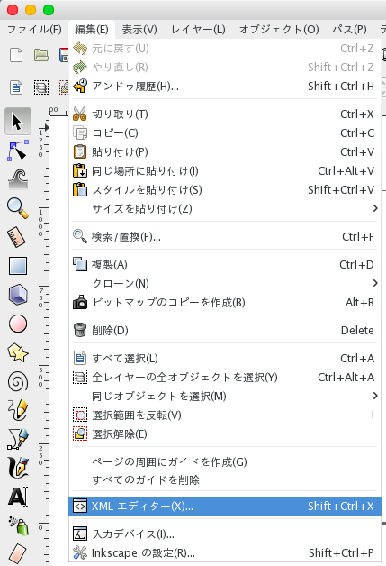
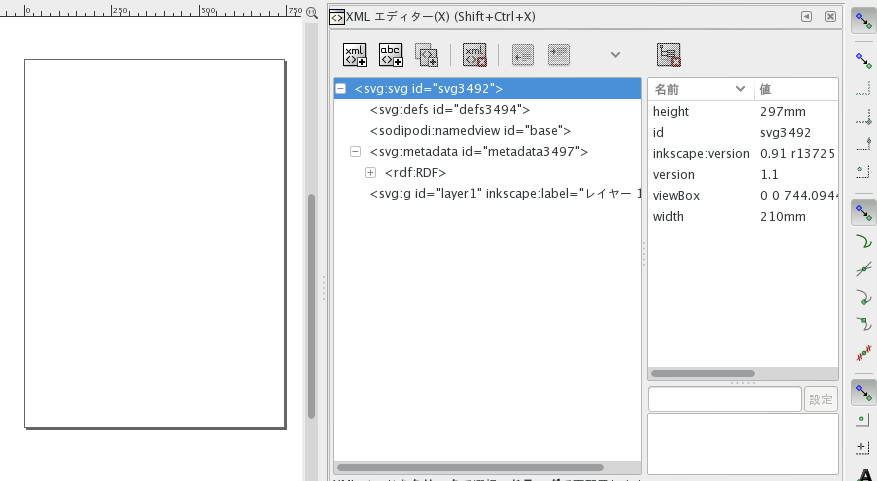
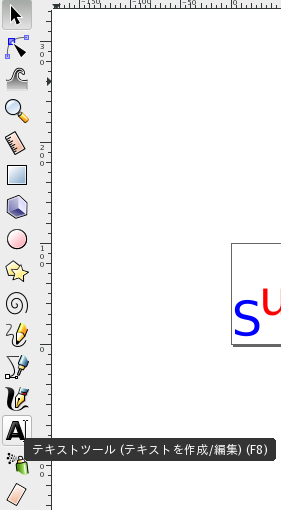
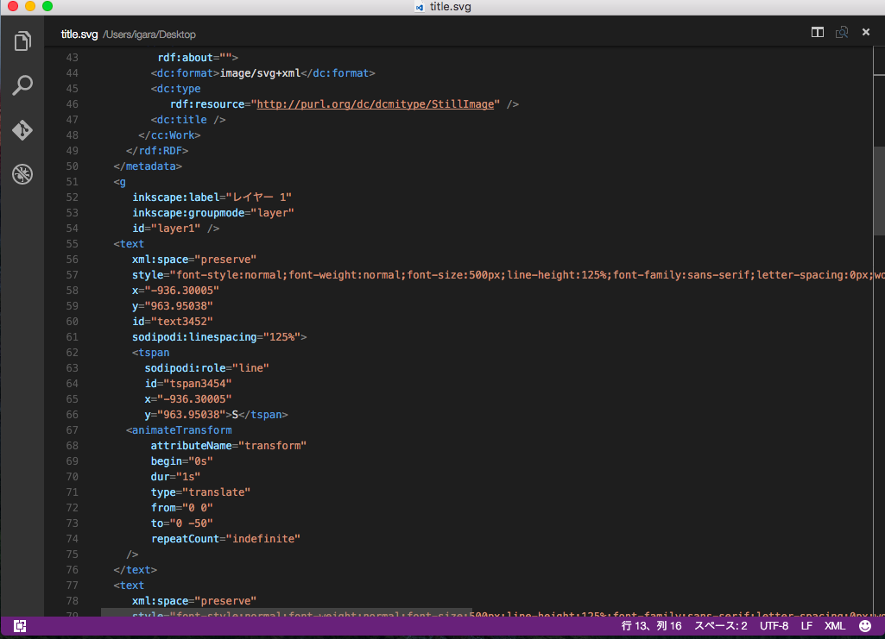

# 内容

CSSで動くイラストを描いてみた（おまけでPostCSS導入のお話）
http://qiita.com/igara/items/918c6237d0cf8fbc0c1d

> 非イラストレータが初めてPCでイラストを描いた話
> http://qiita.com/igara/items/3a8dfad331652b632eff
>> 新しいデザインを作るということがないのでちょっと勉強がてらに絵を描いてみたという話になります。

> 前回描いた絵からの教訓で簡単なイラストだったら画像を使わずにCSSで表示可能なのでは？と思った為実践してみたというお話になります。

前回はCSSを用いて絵を描いてましたが、図形の角度をコードで変更したりと計算が辛かった為、
グラフィックツールでGUI的に編集できたら便利そう！というのと
尚且つアニメーション追加できたら面白そう！
と思ったので試しにやってみたという内容になります。

# SVGとは

SVG：Scalable Vector Graphics

JPGやPNGと呼ばれる画像はビットマップデータというものでデータの実態はバイナリです。
それに対しSVGはベクターデータと呼ばれるものでデータの実態はXMLで構成されているものになります。
なのでちょっとしたデザインの修正をソース修正で行うことが可能です。

この二つにはそれぞれ得意・不得意としているものがあります。
参考リンク：「ビットマップデータ」と「ベクターデータ」の違い
http://webgaku.hateblo.jp/entry/20120408/1333859650

近年、SVGはブラウザでもサポートされるようになった為、
できればデザインはSVGで構築したいなと思いました。

こちらは現在のSVG対応のブラウザバージョン状況です。
http://caniuse.com/#feat=svg-img


# Inkscape

[Inkscape](https://inkscape.org/)

SVGを作成するために使用したソフトウェア
MacやWindows、Linuxにマルチプラットフォームで対応されている。
（Macは別途XQuartzをインストールする必要がある）
Inkscape以外のソフトウェアですとAdobe IllustratorとかSketchなどでも作成可能です。
何気にLibreOfficeのDrawでも作成は可能のようです。


筆者はMacによるInkscapeの使用となります。
Macですとコピーや貼り付けを普段はCommandキーを押して行っているかと思いますがControlキーでコピー貼り付けを行うなど操作点でWindowsに近いものがあるように感じました。


## とりあえずXMLエディターを開こう!

前述でも記載しましたがSVGはXMLで構成されていますので
Inkscapeを開いたときは
メニューバーより 「編集」→「XMLエディター」を選択しましょう。




すると画面の右側にこんなものが出てくるかと思います。



height 297mmやwidth 210mmとありますがここを編集することで左に表示されている枠の大きさを変更することが可能です。

## 文字を入れてみる



左のツールバーに「テキストツール」があるのでこちらを選択して文字を入れたい箇所へクリックすることで文字の追加が行えます。

文字の追加を行うとXMLの方にも自動で追加されます。


上の画像は追加した文字のXMLの内容ですが文字の色やサイズの指定方法が「style」に記載されています。
styleの内容ですがこちらはCSSによるものです。
文字を移動したい時、文字の大きさを変えたい時はXMLの変更からも行えますが、ツールバーの「選択ツール」（マウスマーク）でマウスによるデザインの変更が行えます。

## XMLの記述を削除する

SVGでアニメーションさせる方法として3つあります。

* CSS（このやり方は[前回](http://qiita.com/igara/items/918c6237d0cf8fbc0c1d)やったものになるかと思います。）
* SVGのanimationタグ→こちらは一部ブラウザでは非推奨となっております。http://ssvvgg.net/post/127068682345/2015%E5%B9%B408%E6%9C%8819%E6%97%A5%E3%81%AEsvg
* JavaScript

今回もCSSを用いてアニメーションの追加を行ってみましょう。

せっかくInkspaceを使っていたところですが適当なテキストエディタで開きます。
テキストエディタでSVGを開くと下記のようなXMLが表示されるかと思います。


SVGはHTMLに直書きすることでも動作するので
SVGのソースの最上部に記載されている下記の記述を削除します。

こちらは削除を行っても再度Inkspaceを使ったデザインの修正可能です。

```
<?xml version="1.0" encoding="UTF-8" standalone="no"?>
<!-- Created with Inkscape (http://www.inkscape.org/) -->
```

削除した理由としてですが
このSVGファイルをHTMLのモジュールとして読み込んであげて後でCSSのアニメーション追加を行っていこうという方針にしました。（もっと良い方法がありそう...）

## アニメーションの追加

作成したSVG中の要素は自動でidの指定がされているかと思います。
（textXXXXとかpathYYYYとか）
こちらのidに対してCSS3のアニメーション指定することで動かすことが可能になります。
もちろんidの名前を変更することも可能です。

CSS3のアニメーションについては下記のサイトを参考にしました。

animation－CSS3リファレンス
http://www.htmq.com/css3/animation.shtml
css3のanimationを使ってみたら予想以上に簡単だった！
http://sterfield.co.jp/designer/css3%E3%81%AEanimation%E3%82%92%E4%BD%BF%E3%81%A3%E3%81%A6%E3%81%BF%E3%81%9F%E3%82%89%E4%BA%88%E6%83%B3%E4%BB%A5%E4%B8%8A%E3%81%AB%E7%B0%A1%E5%8D%98%E3%81%A0%E3%81%A3%E3%81%9F%EF%BC%81/

# 所感・感想・まとめ

基本SVGファイルはInkspaceでいじる（HTMLに書き起こす作業についてWebPackがうまく解決してくれました）、アニメーション処理はCSSファイルで追加すると処理の分割ができました。

アニメーションの箇所は結局また独自のCSSアニメーションの追加を行っていた為、次はライブラリを使って豪華なアニメーションを追加していきたいなと思います。

# 参考ページ
滑らかで美しい表現ができる！SVGアニメーションを使ってみよう
https://blog.codecamp.jp/svg_animation_intro
WEBデザイナーのはじめての「SVG」
https://webkikaku.co.jp/blog/webdesign/svg_for_webdesigner/
