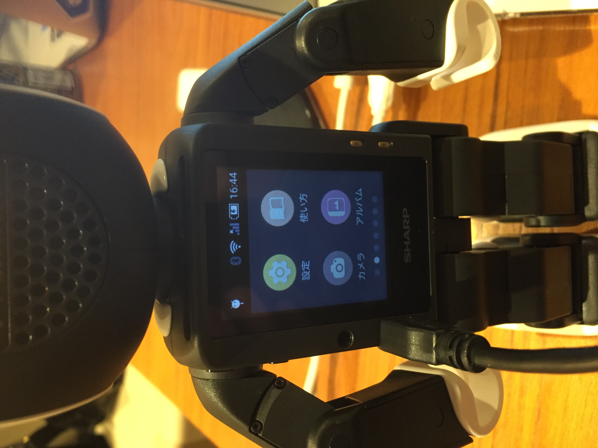
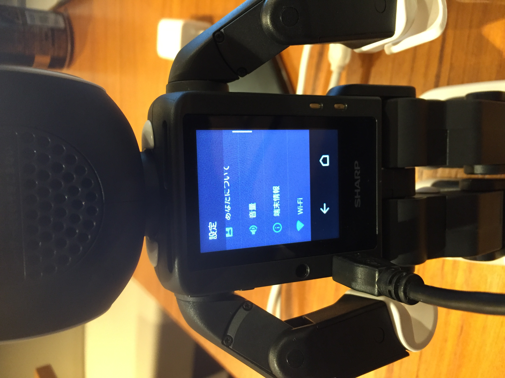
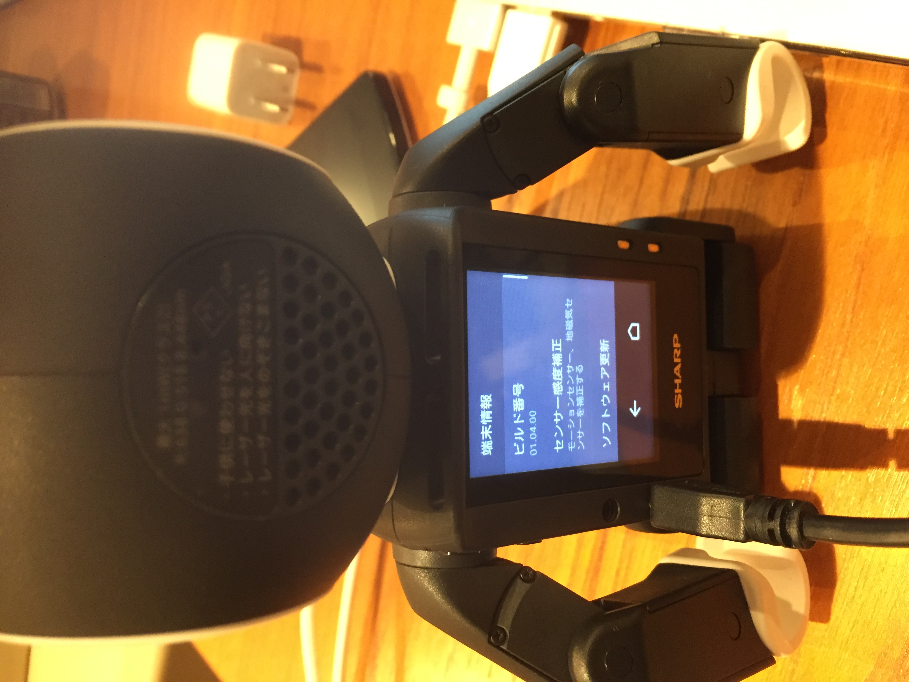
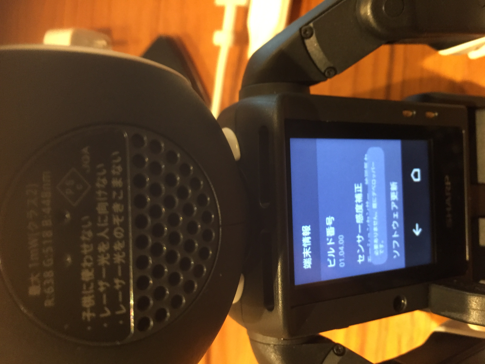
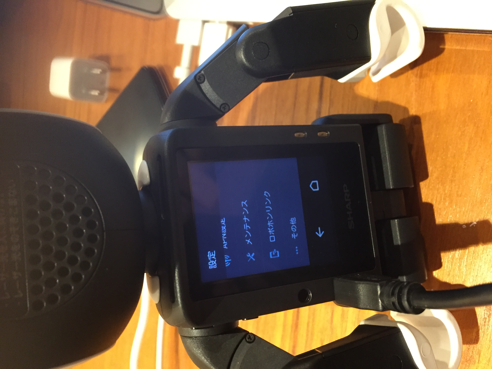
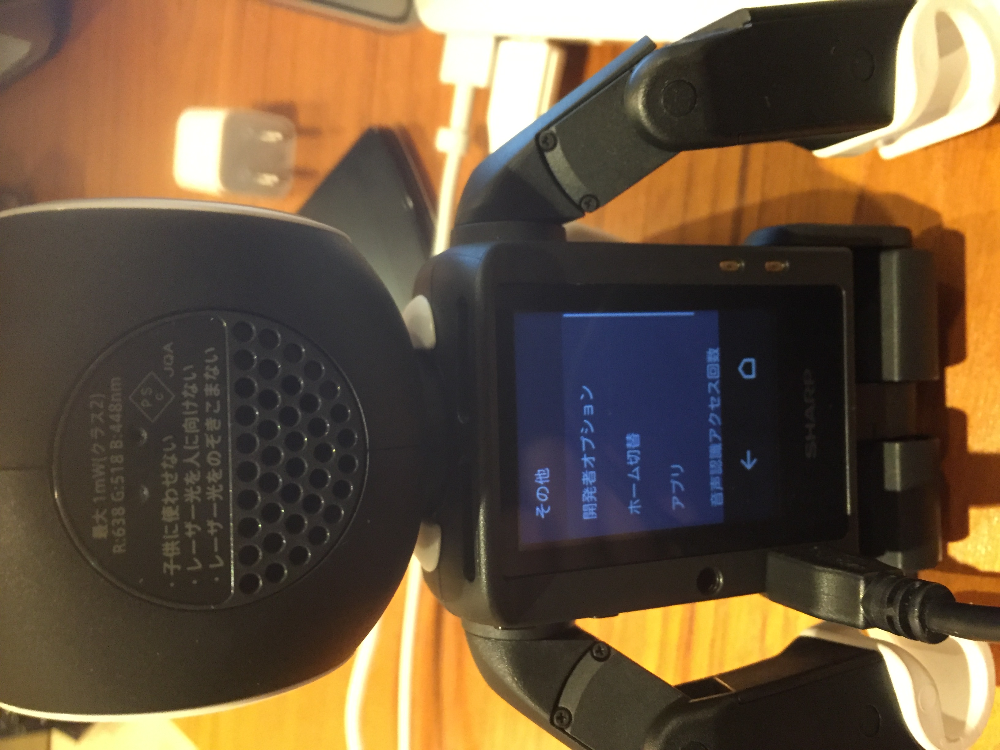
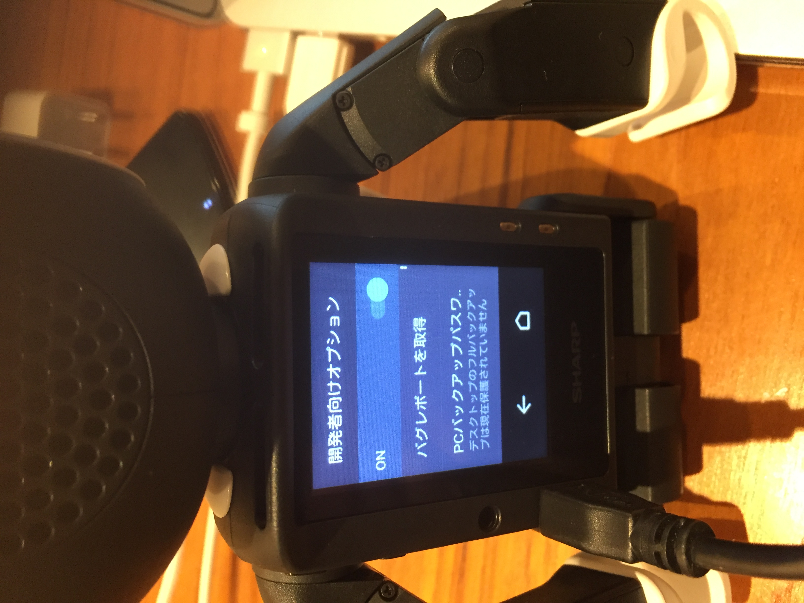
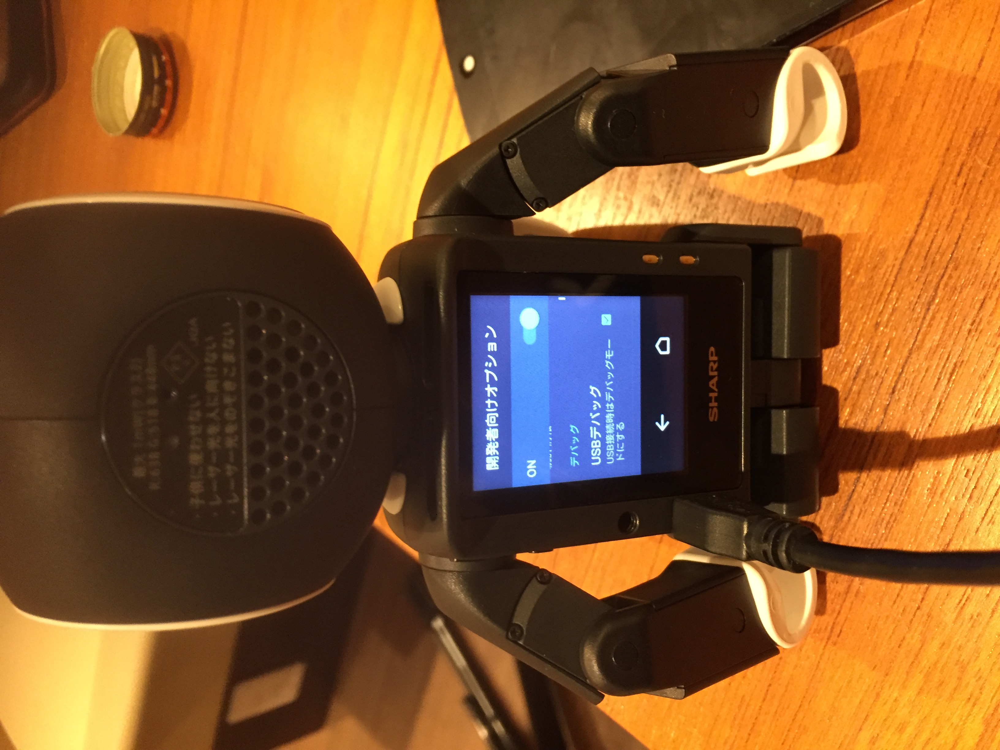

# この記事では  
RoBoHoN開発をmacで行った時に公式で公開されているサンプルコードをビルドして実行するまでの手順について記載する

# 準備物  
Android Studio 2.1.1
ADB DebugできるUSB mini端子
※macですのでADB Driverのインストールは不要

# RoBoHoNをUSB経由でアプリインストールできるようにする
よくあるAndroidのデバッグモード切り替えの方法と同じだった  

1. ロボホンの背中から「設定」を押す  

2. 「端末情報」を押す  

3. 「ビルド番号」を複数回押す  

この時点でRoBoHoNは開発モードになります  

4. 「設定」画面から「その他」を押す  

5. 「開発者向けオプション」を押す  

6. 「On」にする  

7. 「USBデバッグ」をチェックする

この手順でADBデバイスとして認識されるようになり、Andoid Studioから自作アプリインストールができるようになる
次回はアプリ作成
