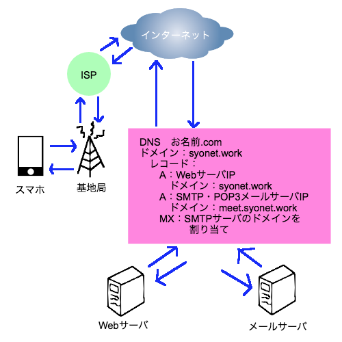

# 内容

何番煎じかになるが
お名前.comで入手したドメインを個人で作成したメールサーバに結びつけるためのメモ
追加でGmail・スマホアプリにも受信する設定を記載

# モチベーション

メールでやりとりすること実際そんなにないが
開発とかでSNSアカウントをすぐに作りたいとき用にあれば良いかという程度のモチベーション
後に後付け理由を記載している

## 個人のメールアドレスを得たい

つい最近キャリアから格安スマホの会社に乗り換えた際に今まで使用していたメールアドレスを失効した。
乗り換え先の会社のドメインによるメールアドレス追加オプションというのもあったが
自分のドメイン所有してたのでどうせなら自分のドメインのメールアドレス作っちゃおうかという気持ちになった。

## PCでもスマホでも容易に同じメールアドレスでやりとりしたい

そうそうないがMNPで機種乗り換えした時、
メールアドレス変わったので〜〜〜というやりとりが不毛に思えてきた。
携帯なくした時でもPCから連絡できる手段得たいというのもある。

# ざっくりとしたネットワーク図

Webサーバとは分離してメールサーバを作成している
メールサーバ上では受信のPOPと送信のSMTPの両方を起動させている

# ざっくりとした構築参考

下記のリンクを順番に実行していく

メールサーバー構築(Postfix+Dovecot)
https://centossrv.com/postfix.shtml

メールサーバー間通信内容暗号化(Postfix+Dovecot+OpenSSL)
https://centossrv.com/postfix-tls.shtml
