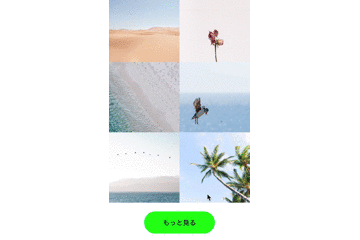
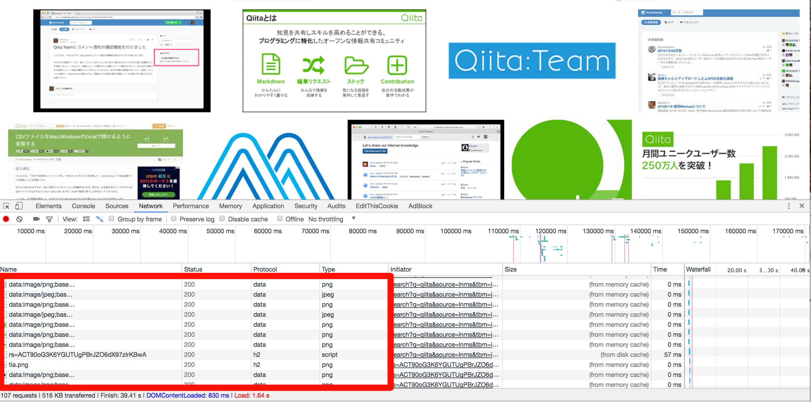

# はじめに & モチベーションまわり

この記事では
**更読みがあるような一覧画面での画像収集方法**
について一部記載します。

更読みがある一覧画面とは言わずもがなという感じもしますが



なんかボタンを押したらさらに情報が出てきたり、


画面の一番下に行ったらさらに画像が読み込まれるような画面です。


動機としては最近やっぱり独自でデータを所有していること前提でビジネス動いてるなというのあり、
最低限のデータ収集方法を身に付けたいというのがありました。


その中でデータ収集の中で画像を集めることというのが
今の僕の趣味に一番マッチしてたのでやってみたという話です。

## なぜHeadless Chromeを使った画像収集を行おうとしたのか

理由は多々あって

- 最近はSPA(シングルページアプリケーション)なページが多い為、
どうしてもブラウザの機能使ったデータ取得がしたかった。

- 某SNSでAPIによる画像URL取得できるが、
某他サイトではAPIがオープン公開されてない or
~~APIの仕様を調べるのが面倒~~
なのでブラウザに見えるありのままの一覧情報を~~こそっと~~
ごそっと持ってきたかったから。

## 結果的にできたもの

**即席で画像を集めたかったのでコードの内容は煩雑です。お許しください。**

使い方としてこちらのREADME参照
https://github.com/igara/image_shiki

puppeteerを使用した例
https://github.com/igara/image_shiki/blob/a115335016cd3d301daf1e959ed4fa3d0bbe976d/puppeteer.js

chrome-launcherとchrome-remote-interfaceを使用した例
https://github.com/igara/image_shiki/blob/aa8b39d0a74ee10e780cd8b40a3e82cb0b1abdf5/chrome_launcher.js

最初はchrome-launcherとchrome-remote-interfaceを使って画像取得ツール作成してましたが、
とある噂でpuppeteerの方が楽という強い言葉を聞き、puppeteerも使用してみました。

**本記事の内容もpuppeteerを中心に寄せて記載します。**

比較してみて一部の [Chrome DevTools Protocol](https://chromedevtools.github.io/devtools-protocol/) による機能の関数化がpuppeteerではされていなかったりしますが下記のコードで使用することができます。

```
page._client.send('使用したいChrome DevTools Protocolメソッド名', {パラメータ});
```

puppeteerで関数化されていないChrome DevTools ProtocolというのはだいたいがEXPERIMENTAL（試験的な）と記載されているものが多いです。

後記で出てくる[Page.getResourceTree](https://chromedevtools.github.io/devtools-protocol/tot/Page/#method-getResourceTree)もEXPERIMENTALなものの１つです。

# 僕のHeadless Chromeを用いた画像収集方法

大雑把に手順を公開すると

1. Headless Chromeでみている画面を  
コードでスクロール or 「もっと見る」リンクを押下して追加の画像を読み込む
2. Chrome DevTools Protocolの１つである[Page.getResourceTree](https://chromedevtools.github.io/devtools-protocol/tot/Page/#method-getResourceTree)を使用して  
画像のリソースを取得する
3. 画像を保存する

な手順で画像を集めました。

**先にこの収集方法の欠点をいうと**

- Web画面のデザイン変更を行われると大量の画像取得できなくなる
- Chrome起動やっぱりメモリいっぱい取られる

などなどありますが、
上記の手順についてさらに詳しく説明していきたいと思います。


## 1. Headless Chromeでみている画面をコードでスクロール or 「もっと見る」リンクを押下して追加の画像を読み込む

### スクロール方法

puppeteerによるHeadless Chromeのスクロール方法についてのコード部分
https://github.com/igara/image_shiki/blob/1396197fa28d9657869df1945dba6cfdc38ca65c/puppeteer.js#L85-L93

ここで注意することはスクロールの処理が非同期的なものなので
await / async ちゃんとしてないと
無駄にスクロールしてるけど画像あまり拾えてないとなってしまいます。

### 「もっと見る」リンクの押下方法

puppeteerによるHeadless Chromeのリンク押下方法についてのコード部分
https://github.com/igara/image_shiki/blob/1396197fa28d9657869df1945dba6cfdc38ca65c/puppeteer.js#L80-L81

こちらのボタンの指定は `page.$` を使用しましたが [document.querySelector](https://developer.mozilla.org/ja/docs/Web/API/Document/querySelector) のようなHTMLのセレクタ・クラスなどの指定からHTMLElementを指定することができます。

## 2. Chrome DevTools Protocolの１つである[Page.getResourceTree](https://chromedevtools.github.io/devtools-protocol/tot/Page/#method-getResourceTree)を使用して画像のリソースを取得する

先ほどから[Page.getResourceTree](https://chromedevtools.github.io/devtools-protocol/tot/Page/#method-getResourceTree)という単語だけ先行して出てきていますが
こいつは何なのかというとChromeの開発ツールのNetworkタブで表示されるリソースを取得することができます。

どうゆうことかというと



赤枠の箇所の情報を全て取得できるわけです。
当然不要なリソースも存在するかと思いますので任意で取り除いたりすると良いかと思います。

コードとしてこちらになります。
https://github.com/igara/image_shiki/blob/1396197fa28d9657869df1945dba6cfdc38ca65c/puppeteer.js#L112-L114

## 3. 画像を保存する

Page.getResourceTreeで画像のURLを取得できるわけですが
(http|https)〜〜〜から始まるURLのパターンと
data:image〜〜〜から始まるパターンがありますので
それぞれのパターンでの画像データ取得について説明します。

ソース上では趣味上の理由により謎のjpgに変換する処理がありますが
気にしないでください。

### (http|https)〜〜〜から始まるURLのパターン

https://github.com/igara/image_shiki/blob/1396197fa28d9657869df1945dba6cfdc38ca65c/puppeteer.js#L130-L132

レスポンスからバイナリデータを引っ張ってくる処理を行なっています。

### data:image〜〜〜から始まるパターン

https://github.com/igara/image_shiki/blob/1396197fa28d9657869df1945dba6cfdc38ca65c/puppeteer.js#L127-L128

base64エンコード文字列の部分だけを持ってきて再度バイナリにする処置を行なっています。

### あとは取得したバイナリデータをファイル書き込みするだけ

https://github.com/igara/image_shiki/blob/1396197fa28d9657869df1945dba6cfdc38ca65c/puppeteer.js#L143-L143

すみません。ファイル名適当すぎました。

以上で僕の画像収集方法についての説明になります。

# さいごに & やってみた感想

アドベントカレンダーやらなきゃという圧に屈して記載したのですが
なかなかこの話題は記載していて罪悪感があるというのか...
ただ遊びのための技術を得る楽しさがありました。

後日のアドベントカレンダーも楽しみですね!
