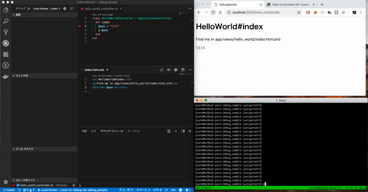

# この記事は

VSCodeとgemのruby-debug-ide・debaseを用いてデバックできましたといった記事は多いのですがリモートデバッガーを利用する場合、環境周りなどその節々でなかなか実行できないというのが経験上多かったので参考程度にみていただければいいなぁと思います。




# プロジェクト

- Rails: 5.2.1
- Ruby: 2.5.3
- VSCode: 1.28.2
- VSCode Extension Ruby(rebornix.ruby): 0.20.0
- gem ruby-debug-ide: 0.6.1
- gem debase: 0.2.2

## ソースコード

https://github.com/igara/debug_sample

MacOSから直接Rails起動した時と
Dockerから起動した時のデバックを検証したソースになります。

### プロジェクト構成

0-img-tag.png

後々DBなどのミドルウェアや別のアプリケーションの追加しやすいようにRails用のディレクトリを切って構成しました。

### VSCodeのデバック設定(launch.json)

[.vscode/launch.json](https://github.com/igara/debug_sample/blob/master/.vscode/launch.json)

```
{
    "version": "0.2.0",
    "configurations": [
        {
            "name": "Local - Listen for rdebug-ide",
            "type": "Ruby",
            "request": "attach",
            "cwd": "${workspaceRoot}/rails",
            "remoteHost": "0.0.0.0",
            "remotePort": "1234",
            "remoteWorkspaceRoot": "${workspaceRoot}/rails",
            "useBundler": true
        },
        {
            "name": "Local Docker - Listen for rdebug-ide",
            "type": "Ruby",
            "request": "attach",
            "cwd": "${workspaceRoot}/rails",
            "remoteHost": "0.0.0.0",
            "remotePort": "1234",
            "remoteWorkspaceRoot": "/rails",
            "useBundler": true
        }
    ]
}
```

- Local - Listen for rdebug-ide  
  こちらはDockerを使用しないで直接Railsを起動した時の設定です。  
  一旦、下記のようにrailsディレクトリに移動してからbundle installを行いデバック用のrails起動コマンドを実行し、VSCodeのデバックを実行することができます。

```
$ cd rails
$ bundle install --path vendor/bundle
$ bundle exec rdebug-ide --host 0.0.0.0 --port 1234 --dispatcher-port 26162 -- bin/rails s
```

- Local Docker - Listen for rdebug-ide  
  こちらはDockerを使用したRailsデバックの設定になります。  
  remoteWorkspaceRootがコンテナ先のディレクトリ階層になります。  
  下記はデバック用に作成したDockerを起動するコマンドで起動後VSCodeのデバックが可能になります。

```
$ docker-compose -f docker-compose.debug.yml up
```

[docker-compose.debug.yml](https://github.com/igara/debug_sample/blob/master/docker-compose.debug.yml)と[docker-compose.yml](https://github.com/igara/debug_sample/blob/master/docker-compose.yml)の2つのファイルがありますが違いとして
Rails起動しようとするコマンドにrdebug-ideがあるかないかの違いと
デバックで使用するポートを開けてるかの違いしかありません。

### Ruby 2.5.3 Rails 5.2.1のデバックではまったところ

下記のURLに現象と解決方法が書いてあったのですが

https://superuser.com/questions/1359747/is-it-possible-to-get-visual-studio-code-ide-debugging-of-apps-on-rails-5-2-to-w

あまり解説を見てもちょっと理解しきれていないのですが
Ruby 2.5系のtrace命令を削除することによる5～10%の高速化の対応と
gemのbootsnapによるRails起動時の最適化によるもので
デバックがうまくいかないみたいなのがあるようです。

一旦は[rails/config/boot.rb](https://github.com/igara/debug_sample/blob/master/rails/config/boot.rb)を

```
ENV['BUNDLE_GEMFILE'] ||= File.expand_path('../Gemfile', __dir__)

require 'bundler/setup' # Set up gems listed in the Gemfile.
# require 'bootsnap/setup' # Speed up boot time by caching expensive operations.
unless ( (('2.5.0'..'2.5.3').include? RUBY_VERSION) && defined?(Debugger) )
  # see: https://superuser.com/questions/1359747/is-it-possible-to-get-visual-studio-code-ide-debugging-of-apps-on-rails-5-2-to-w
  require 'bootsnap/setup' # Speed up boot time by caching expensive operations.
end
```

みたいにデバック時はbootsnapを使用しないようにしてデバックできるようにしています。
