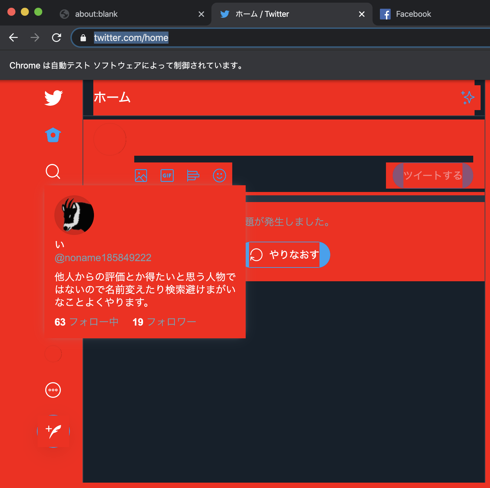
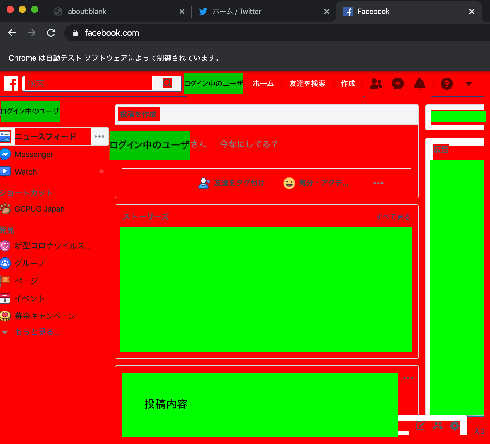
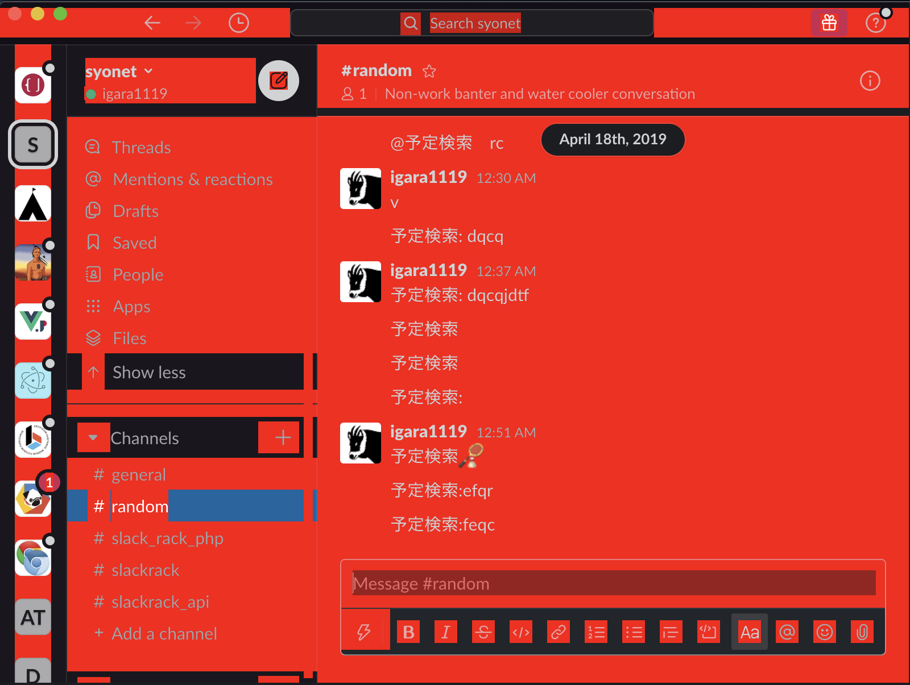
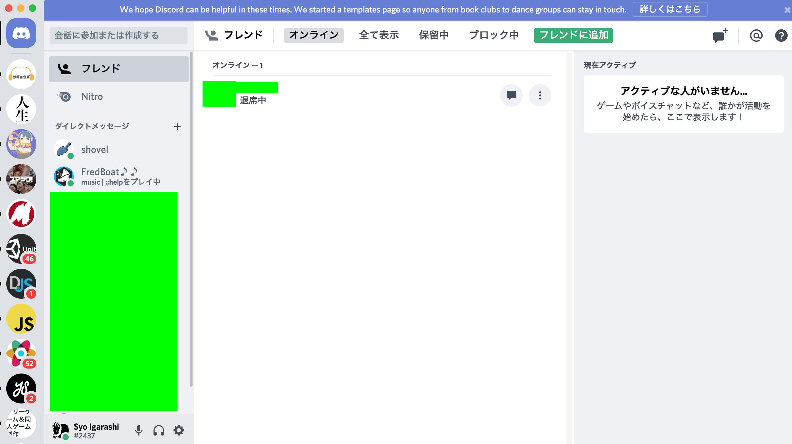

## 最初に

この記事でやろうとしたことを思ったきっかけとして
最近声をかけられるということが少なくなったのでせめてSlackとかのチャットで文字だけでなく声を発してくれるようなのが欲しいと思ったのがはじまりでした。

（このままだと聞き取り能力下がるんじゃないかというの危険視してる。テレビ電話使えよというのはありますが会話としての相手がいないとね...

いろいろ試行錯誤した結果、Electronで作られたアプリとか既にChromeで使用しているアプリに対して「こんな操作方法ある？」というやり方ができてしまったので記事にしました。

## 対象のアプリ

実際に試験的に外部のアプリを操作しているアプリです。
macOSでのみ使用できます。
https://github.com/igara/speeche/releases/tag/experimental-1
もしかするとソース上で指定しているアプリのパスの違いによって起動できない人もいるかもしれません。

下記は実際に操作している対象のアプリです。

- Chrome
  - Twitter
  - Facebook
- Electron
  - Slack
  - Discord
 
### Chrome

コードとして下記の箇所になります
https://github.com/igara/speeche/blob/26ce768c357eb1ee61f497507f5f06b2445fae14/src/index.ts#L20-L46

```ts
const createChromeBrowser = async () => {
  try {
    const chromeBrowser = await puppeteer.launch({
      executablePath: "/Applications/Google Chrome.app/Contents/MacOS/Google Chrome",
      // userDataDir: path.resolve(path.join(process.env.HOME || "", "Library/Application Support/Google/Chrome")),
      headless: false,
    });

    const twitterCookies = chromeCookies.cookies("twitter.com");
    const twitterPage = await chromeBrowser.newPage();
    for (const cookie of twitterCookies) {
      await twitterPage.setCookie(cookie);
    }
    await twitterPage.goto("https://twitter.com/home");
    await twitterPage.addStyleTag({ content: `* {background: red;}` });

    const facebookCookies = chromeCookies.cookies("facebook.com");
    const facebookPage = await chromeBrowser.newPage();
    for (const cookie of facebookCookies) {
      await facebookPage.setCookie(cookie);
    }
    await facebookPage.goto("https://www.facebook.com");
    await facebookPage.addStyleTag({ content: `* {background: red;}` });
  } catch (error) {
    console.error(error);
  }
};
```

`executablePath`には実際に使用しているChromeのアプリ内の実行ファイルを指定しています。
`userDataDir`がコメントされていますがこれ使用できればChromeでログインしているユーザの状態でpuppeteerの操作ができそうですが**UnhandledPromiseRejectionWarning: Error: Failed to launch chrome!**という実行エラーが出てしまったのでコメントにしています。

### Twitter

該当箇所こちら
https://github.com/igara/speeche/blob/26ce768c357eb1ee61f497507f5f06b2445fae14/src/index.ts#L28-L34

```ts
const twitterCookies = chromeCookies.cookies("twitter.com");
const twitterPage = await chromeBrowser.newPage();
for (const cookie of twitterCookies) {
  await twitterPage.setCookie(cookie);
}
await twitterPage.goto("https://twitter.com/home");
await twitterPage.addStyleTag({ content: `* {background: red;}` });
```

行っていることとしてtwitterのドメインで取得できるCookieを設定してTwitterのページを開き、CSSの追加をしているという処理をしています。
Cookieの取得についてですが下記のツールから取得したものを使用しています。
https://github.com/igara/chrome-cookies

これを実行すると下記のような画面が表示されるようになります。



タイムラインの箇所はCookieではない別のストレージの情報から取得するようになっているようなので中途半端なログインな状態で表示されます。
（タイムラインの箇所とるためにCookie同様にLocal Strage取得用CLI作ろうとしたのですがLevelDBから取れたLocal Strageの値が暗号化されててうまく複合化できずにめげました。

### Facebook

該当箇所こちら
https://github.com/igara/speeche/blob/26ce768c357eb1ee61f497507f5f06b2445fae14/src/index.ts#L36-L42

```ts
const facebookCookies = chromeCookies.cookies("facebook.com");
const facebookPage = await chromeBrowser.newPage();
for (const cookie of facebookCookies) {
  await facebookPage.setCookie(cookie);
}
await facebookPage.goto("https://www.facebook.com");
await facebookPage.addStyleTag({ content: `* {background: red;}` });
```

Twitterとやっていることは同様ですがこちらは他のユーザの投稿内容を取得することが可能みたいです。




## Electron

ElectronのアプリはChromeとは異なり何故か`userDataDir`でユーザの状態を保ったまま開くことが可能みたいです。
「そのパスでいけちゃうもんなの？」という感じが否めなかったです。

### Slack

該当箇所はこちら
https://github.com/igara/speeche/blob/26ce768c357eb1ee61f497507f5f06b2445fae14/src/index.ts#L48-L64

```ts
const createSlackBrowser = async () => {
  try {
    const slackBrowser = await puppeteer.launch({
      executablePath: "/Applications/Slack.app/Contents/MacOS/Slack",
      userDataDir: path.resolve(path.join(process.env.HOME || "", "Library/Application Support/Slack")),
      headless: false,
    });
    const pages = await slackBrowser.pages();

    pages.forEach(async page => {
      await page.waitFor(1000);
      await page.addStyleTag({ content: `* {background: red;}` });
    });
  } catch (error) {
    console.error(error);
  }
};
```




### Discord

該当箇所はこちら
https://github.com/igara/speeche/blob/26ce768c357eb1ee61f497507f5f06b2445fae14/src/index.ts#L66-L82

```ts
const createDiscordBrowser = async () => {
  try {
    const discordBrowser = await puppeteer.launch({
      executablePath: "/Applications/Discord.app/Contents/MacOS/discord",
      userDataDir: path.resolve(path.join(process.env.HOME || "", "Library/Application Support/Discord")),
      headless: false,
    });
    const pages = await discordBrowser.pages();

    pages.forEach(async page => {
      await page.waitFor(1000);
      await page.addStyleTag({ content: `* {background: red;}` });
    });
  } catch (error) {
    console.error(error);
  }
};
```

DiscordはSlackと異なって


一瞬DOMのかけらのようなものが表示されて



いつものような画面が表示されているので遅延的に複数のpageを扱うようにしているみたいです。

## 最後に

今回は`page.addStyleTag`によるスタイル変更しか実施していないですが
puppeteerには`page.evaluate`というアプリケーション内でJavaScriptを実行できるものがあったりするのでより高度な操作を要求する場合はpuppeteerのドキュメントを見るとよりいろんなことできそうと妄想を膨らますことができるんじゃないかと思います。
