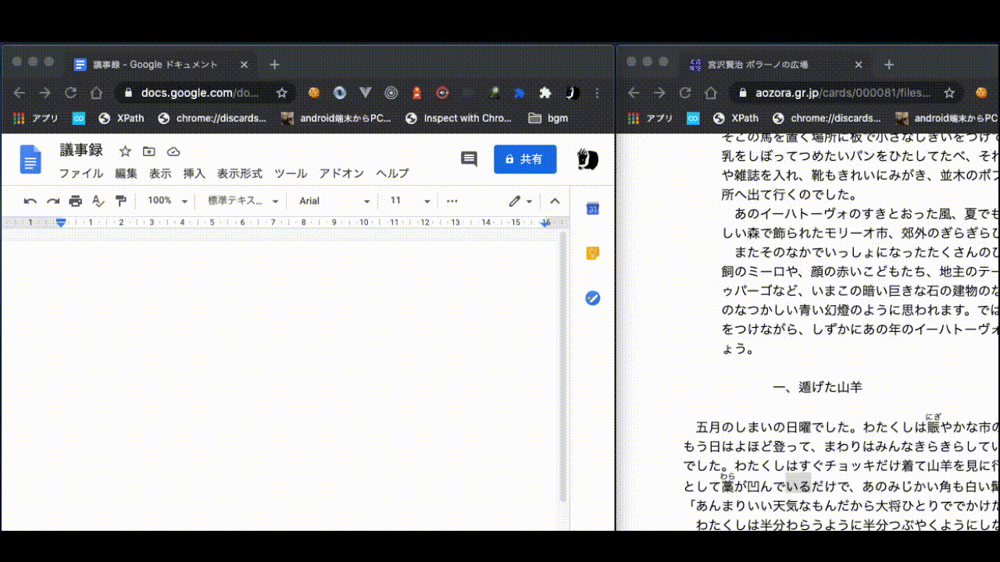
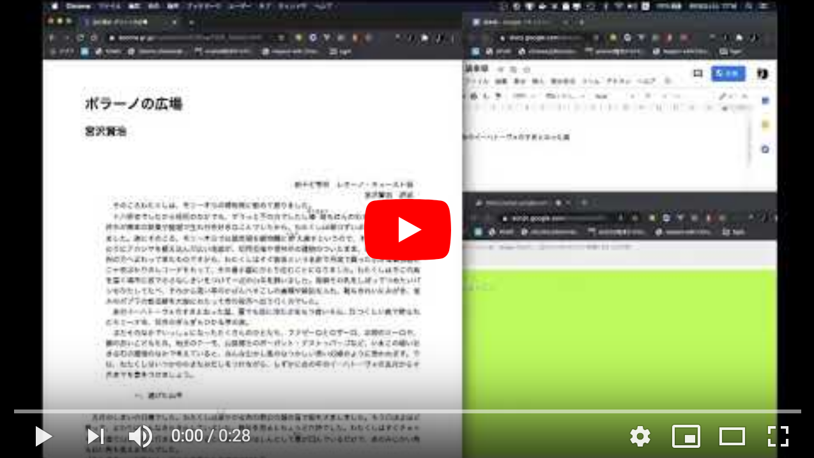
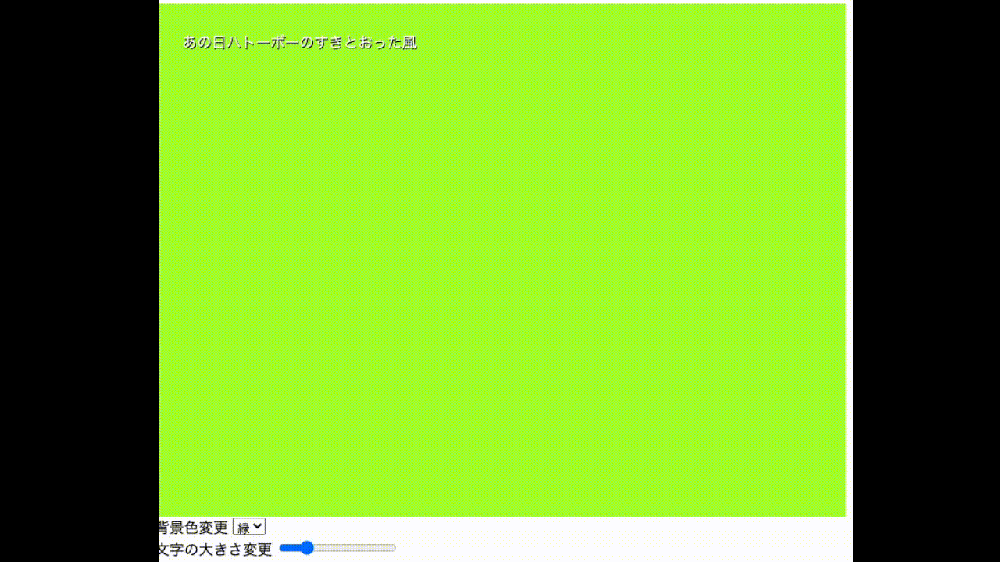
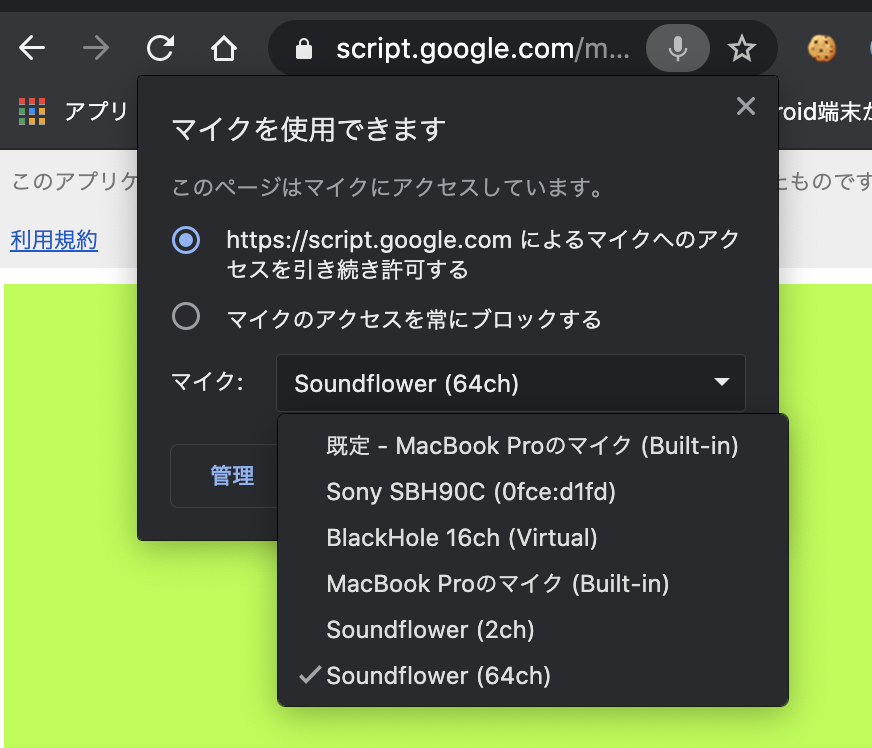

## この記事は

喋ったことを文字で確認できるようなものなにかないか探していてGoogle Docsの音声入力というものがあることを知ったわけですが


(GIFアニメ)

音声入力中に他のアプリをクリックしてしまうと自動で終了されてしまいます。

なんとかならんものかと考えたところ、ChromeのSpeech Recognition APIとGASのWebアプリケーションを使えば解決できたので解説していこうといった内容です。

## どのようなものが仕上がったのか

↓の画像は動画のリンクになっております。

[](https://www.youtube.com/watch?v=yeq7vMeb7sA)

↓のリンクはソースコードです。

https://github.com/igara/speech-to-docs

## 使い方

### DocsとGASのWebアプリの作成

NodeJS v12.14.0使っていましたがたぶんよほど古くなければ他のバージョンでも大丈夫かと思います。
コマンドを羅列すると

```
git clone https://github.com/igara/speech-to-docs
cd speech-to-docs
npm install

# Googleの認証を行う
npx clasp login

# exampleという名前のDocsに紐づくGASプロジェクトを同時に作成する
npm run new name=example

# TypeScriptで記載されたコードをGAS用にビルド
npm run build

# ビルド済みのコードをGASプロジェクトに転送する
npx clasp push
```

ここまでの作業が完了したらDocsから
メニュー -> ツール -> スクリプトエディタ

スクリプトエディタ上で
メニュー -> 公開 -> ウェブアプリケーションとして導入...

を選択し、作成しようとすると認証確認が出ると思うので認証させれば完成です。
ウェブアプリケーションとして導入にあるURLが開ければ完了です。

### GASのWebアプリ


(GIFアニメ)

背景色変更や文字の大きさの変更が可能だったりするので配信する人とかはここを変えてOBSのクロマキー処理とかも使ったりしたらいい感じになるんじゃないでしょうか。



マイクの設定は各自使用しているものに適応してください。

## コード説明

### [src/gas](https://github.com/igara/speech-to-docs/tree/master/src/gas)  
  GASのスクリプトエディタに反映するコードを記載しています。
#### [appsscript.json](https://github.com/igara/speech-to-docs/blob/master/src/gas/appsscript.json)  

```
  "executionApi": {
    "access": "ANYONE"
  },
```

の箇所はclaspのデバッグの都合でANYONEにしています。
今回の記事にはデバッグの仕方を記載しませんがやってみる場合はこちらの記事を参考にすると良いかもしれません。主にCloud Consoleでの設定がつむポイント
[clasp run できないとき。2018-09-25](https://qiita.com/abetomo/items/59379e26679e342ef6e3)

```
  "webapp": {
    "access": "MYSELF",
    "executeAs": "USER_DEPLOYING"
  },
```

"access": "MYSELF"はWebアプリケーションを使用できる人を自分だけにするために設定しています。
"executeAs": "USER_DEPLOYING"はnpx clasp deployでもWebアプリケーションの更新ができるようなので設定しています。
ただし初回の時はスクリプトエディタ上で承認しないと反映されないようです。
Docsのアクセス権限はデフォルト自分のみになっているので後でブラウザからDocsはURLわかる人には閲覧できるようにするとかするとリアルタイムで議事録が動いているのがDocs経由でみれるとかできます。

#### [index.html](https://github.com/igara/speech-to-docs/blob/master/src/gas/index.html)

GASのWebアプリケーションを構成するHTMLです。

```
   <?!= HtmlService.createHtmlOutputFromFile("css").getContent(); ?>
   <?!= HtmlService.createHtmlOutputFromFile("js").getContent(); ?>
```
https://github.com/igara/speech-to-docs/blob/master/src/gas/index.html#L5-L6

外部のファイルを呼び出しを上記で行っている点以外は標準なHTMLかと思います。

#### [css.html](https://github.com/igara/speech-to-docs/blob/master/src/gas/css.html)

HTMLファイルですがGASのWebアプリケーションを構成するCSSです。

VSCodeでもstyleタグの補完が効いてくれていたので特に困ることがなかったです。

#### [js.html](https://github.com/igara/speech-to-docs/blob/master/src/gas/js.html)

HTMLファイルですがGASのWebアプリケーションを構成するJavaScriptです。

このファイルもTypeScript化しようかと思いましたが既にGASの関数定義でWebpack等使っているのもあり、Webアプリケーション上ではHTMLファイルじゃないと外部読み込みできないというのもあって普通にJavaScriptで書くようにしました。


```
google.script.run.setText(logText);
```
https://github.com/igara/speech-to-docs/blob/master/src/gas/js.html#L33

というのがありますがWebアプリケーション側のJavaScriptでgoogle.script.run.xxxのような記載をするとGASの関数が起動可能みたいです。


#### [do_get.ts](https://github.com/igara/speech-to-docs/blob/master/src/gas/do_get.ts)

WebアプリケーションのURLを開いた時に[index.html](https://github.com/igara/speech-to-docs/blob/master/src/gas/index.html)を開く処理を記載しています。

#### [do_post.ts](https://github.com/igara/speech-to-docs/blob/master/src/gas/do_post.ts)

POSTで音声認識とは別でDocsにテキスト反映できるかテスト用に作成しただけのものです。

#### [set_text.ts](https://github.com/igara/speech-to-docs/blob/master/src/gas/set_text.ts)

[js.html](https://github.com/igara/speech-to-docs/blob/master/src/gas/js.html)で使われているSpeech Recognition APIの結果をこのGAS関数を使ってDocsに文字起こしをしています。

### [src/tasks](https://github.com/igara/speech-to-docs/tree/master/src/tasks)

CLIで実行するツールなどを扱っています。

#### [create_clasp_json.ts](https://github.com/igara/speech-to-docs/blob/master/src/tasks/create_clasp_json.ts)

```
# exampleという名前のDocsに紐づくGASプロジェクトを同時に作成する
npm run new name=example
```

を実行した時に使用していたスクリプトです。
nameの指定からDocsとGASプロジェクトが作成されるような処理を記載しています。

## 最後に

配信を文字に起こして振り返りがしやすくなる利点ってありそうだけど、音声認識がまだそこまで精密でもないから実施していないのかわかんないですが、この記事をきっかけになにか発展があれば幸いです。
